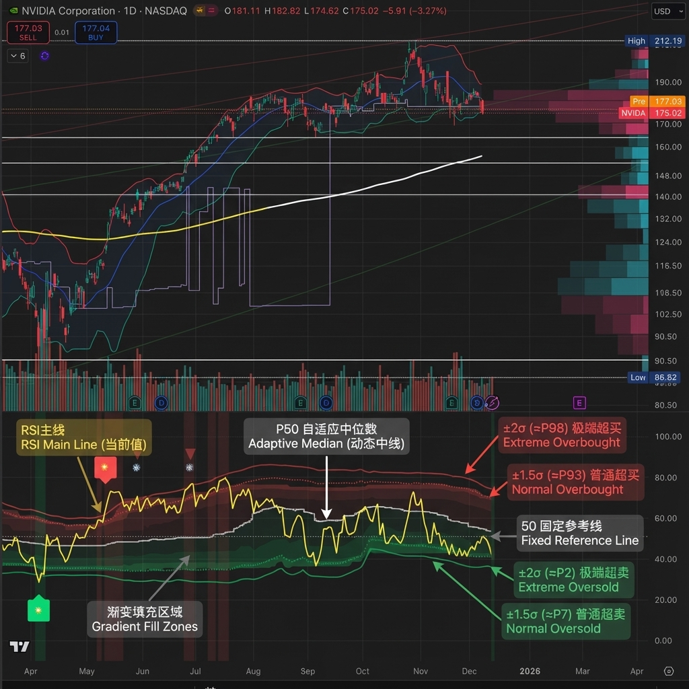

# Adaptive RSI Pro / 自适应RSI专业版

[](https://www.tradingview.com/)
[](https://www.tradingview.com/pine-script-docs/en/v6/)
[](LICENSE)

Dynamic overbought/oversold thresholds + Multi-Timeframe analysis + Divergence detection + Signal statistics.

根据每个标的实际历史分布动态计算超买/超卖阈值，结合多时间框架分析、背离检测和信号统计。

---

## Emoji Legend / 信号图例

### Chart Signals / 图表信号

#### Buy Signals / 买入信号 (底部显示)

| Emoji | Signal Name | Condition | Priority | Action |
|-------|-------------|-----------|----------|--------|
| 🌟 | MTF + Extreme | 3+ timeframes oversold + Z<−2σ | ★★★★★ | **STRONG BUY** 强力买入 |
| 💎 | Divergence + Extreme | Bullish divergence in Z<−2σ zone | ★★★★☆ | **BUY** 买入 |
| 🔥 | Extreme Oversold | Z-Score crosses below −2σ (≈P2) | ★★★☆☆ | **BUY** 买入 |
| ⬆️ | Normal Oversold | Z-Score crosses below −1.5σ (≈P7) | ★★☆☆☆ | Consider buy 考虑买入 (默认隐藏) |
| ↗️ | Bullish Divergence | Price↓ RSI↑ (not in extreme zone) | ★☆☆☆☆ | Watch 观察 (潜在底部) |

#### Sell Signals / 卖出信号 (顶部显示)

| Emoji | Signal Name | Condition | Priority | Action |
|-------|-------------|-----------|----------|--------|
| 🌟 | MTF + Extreme | 3+ timeframes overbought + Z>+2σ | ★★★★★ | **STRONG SELL** 强力卖出 |
| 💎 | Divergence + Extreme | Bearish divergence in Z>+2σ zone | ★★★★☆ | **SELL** 卖出 |
| ❄️ | Extreme Overbought | Z-Score crosses above +2σ (≈P98) | ★★★☆☆ | **SELL** 卖出 |
| ⬇️ | Normal Overbought | Z-Score crosses above +1.5σ (≈P93) | ★★☆☆☆ | Consider sell 考虑卖出 (默认隐藏) |
| ↘️ | Bearish Divergence | Price↑ RSI↓ (not in extreme zone) | ★☆☆☆☆ | Watch 观察 (潜在顶部) |

> **Priority System / 优先级系统**: Only the highest priority signal is shown to prevent overlapping.  
> 只显示最高优先级信号，避免叠加。

---

### Dashboard Status / 仪表盘状态

| Emoji | Status | Meaning |
|-------|--------|---------|
| 🟢 | EXTREME OVERSOLD | Z-Score < −2σ (≈P2.3), strong buy zone / 极端超卖区，强买区 |
| 🟡 | OVERSOLD | Z-Score < −1.5σ (≈P6.7), oversold / 超卖 |
| ⚪ | NEUTRAL | −1.5σ ≤ Z-Score ≤ +1.5σ, no signal / 中性，无信号 |
| 🟠 | OVERBOUGHT | Z-Score > +1.5σ (≈P93.3), overbought / 超买 |
| 🔴 | EXTREME OVERBOUGHT | Z-Score > +2σ (≈P97.7), strong sell zone / 极端超买区，强卖区 |

### MTF Status / 多周期状态

| Emoji | Meaning |
|-------|---------|
| 🟢 | Timeframe oversold / 该周期超卖 |
| 🔴 | Timeframe overbought / 该周期超买 |
| ⚪ | Timeframe neutral / 该周期中性 |

### Divergence Status / 背离状态

| Emoji | Meaning |
|-------|---------|
| 🟢 BULL DIV | Bullish divergence detected / 检测到看涨背离 |
| 🔴 BEAR DIV | Bearish divergence detected / 检测到看跌背离 |
| — | No divergence / 无背离 |

---

### Alert Emojis / 警报图标

| Emoji | Alert Type | Description |
|-------|------------|-------------|
| � | Smart Alert | V6 Unified Alert System / V6统一警报系统 |

---

## Overview / 概述

Traditional RSI uses fixed 30/70 thresholds, but different assets have different volatility characteristics.

传统RSI使用固定的30/70阈值，但不同标的有不同的波动特性。

**Solution**: Calculate thresholds using historical percentiles (P5-P95) + advanced features.

**解决方案**：使用历史百分位（P5-P95）计算阈值 + 高级功能。

---

## Features / 功能特性

### 🎯 Adaptive Thresholds / 自适应阈值
- **Z-Score Based Signals**: Uses statistical Z-Score (±2σ for extreme, ±1.5σ for normal) for consistent cross-asset performance
  使用统计Z-Score（极端±2σ，普通±1.5σ）实现跨资产一致性
- **Percentile Lines**: Display P5/P10/P25/P50/P75/P90/P95 for visual reference
  百分位线（P5-P95）作为视觉参考
- **Dual Display Modes**: Show Z-Score lines, Percentile lines, or both
  双重显示模式：可选择显示Z值线、百分位线或两者

### 🔬 Auto-Adaptive Lookback / 自动自适应回看期
- **Statistical Formula**: Uses `n = (Z × σ / E)²` for optimal sample size calculation
  统计公式：使用样本量公式自动计算最优回看期
- **Dual Volatility System**: Combines short-term (4× RSI length) and long-term volatility (configurable: 6M/1Y/2Y)
  双重波动率系统：结合短期和长期波动率动态调整
- **Precision Control**: Choose High/Normal/Low precision (adjusts acceptable error margin)
  精度控制：高/普通/低精度可选（调整统计误差容忍度）
- **Health Indicators**: Real-time validation of sample coverage, distribution spread, and statistical validity
  健康度指标：实时验证样本覆盖率、分布宽度和统计有效性

### 📈 Auto-Adaptive Trend Filter / 自动自适应趋势过滤
- **Auto Mode**: Automatically selects optimal filter based on RSI volatility percentiles
  自动模式：根据RSI波动率百分位自动选择最优过滤器
- **5 Filter Modes**: Fixed 50, Adaptive P50, SMA(RSI), BB(RSI), or Auto
  5种过滤模式：固定50、自适应P50、RSI均线、布林带或自动
- **Smart Selection**: Low volatility → Fixed 50, Medium → Adaptive P50, High → BB(RSI)
  智能选择：低波动→固定50，中波动→自适应P50，高波动→布林带

### 🌍 Multi-Timeframe RSI / 多时间框架RSI
- **3 Configurable Timeframes**: View RSI status across multiple timeframes (default: 1h/4h/D)
  3个可配置时间框架：跨周期查看RSI状态（默认：1小时/4小时/日线）
- **Auto-Skip Duplicates**: Automatically detects and skips timeframes matching current chart
  自动跳过重复：自动检测并跳过与当前图表相同的时间框架
- **Resonance Detection**: Triggers when 3+ valid timeframes agree (oversold/overbought)
  共振检测：当3个以上有效时间框架一致时触发强信号

> [!NOTE]
> **MTF Signal Confirmation Timing / 信号确认时机**
> 
> - Current timeframe signals update in real-time, confirmed on bar close
> - Higher timeframe signals (e.g., Daily on 1H chart) only update after that timeframe's bar closes
> - **Best Practice**: Wait for current timeframe bar close before acting on MTF resonance signals
> 
> - 当前图表周期的信号：实时更新，K线收盘确认
> - 高周期信号（如日线）：仅在该周期K线收盘后更新
> - **最佳实践**：MTF共振信号建议在当前周期K线收盘后再做交易决策

### 💎 Auto-Adaptive Divergence Detection / 自动自适应背离检测
- **Auto Mode**: Automatically selects parameters based on asset volatility (using ATR)
  自动模式：基于资产波动率（ATR）自动选择参数
- **4 Preset Modes**: Low Vol (3/40), Normal (5/60), High Vol (7/80), Crypto (10/120)
  4种预设模式：低波动/普通/高波动/加密货币，分别对应不同的回看/范围参数
- **Extreme Zone Detection**: Distinguishes divergence in extreme zones (💎) vs normal zones (↗️↘️)
  极端区域检测：区分极端区域背离（💎）和普通背离（↗️↘️）
- **Bullish/Bearish Divergence**: Price lower low + RSI higher low / Price higher high + RSI lower high
  看涨/看跌背离：价格新低+RSI未新低 / 价格新高+RSI未新高

### 📊 Layered Signal Statistics / 分层信号统计
- **4-Tier Classification**: MTF Resonance (🌟) > Divergence+Extreme (💎) > Extreme Only (🔥❄️) > Normal (⬆️⬇️)
  四层分级：多周期共振 > 背离+极端 > 仅极端 > 普通信号
- **Independent Tracking**: Each signal tier has separate count, average return, and win rate
  独立跟踪：每层信号独立统计次数、平均收益、胜率
- **Signal Cooldown**: Optional cooldown period (default 5 bars) to prevent duplicate counting
  信号冷却：可选冷却期（默认5根K线）防止重复计数
- **Real Forward Testing**: Calculates actual returns N bars after signal (configurable 5-100 bars)
  真实前瞻测试：计算信号后N根K线的实际收益（可配置5-100）

---

## Z-Score 与 百分位：双重视角 / Dual Perspective

This indicator displays **both Z-Score and Percentile** to provide complementary views of the same RSI distribution.

本指标**同时显示Z-Score和百分位**，为同一RSI分布提供互补视角。

### Why Both? / 为什么同时显示？

**本质关联**：两者都是描述RSI在历史分布中位置的统计方法
- **Z-Score（标准分数）**：`(RSI - 均值) / 标准差` - 基于正态分布假设
- **百分位（Percentile）**：RSI在历史数据中的排名位置 - 不假设分布类型

**互补优势**：

| 维度 | Z-Score | Percentile |
|------|---------|------------|
| **跨资产一致性** | ✅ 优秀 - BTC和SPY都用±2σ | ⚠️ 因波动率不同而异 |
| **统计学严谨性** | ✅ 置信区间、假设检验 | ⚠️ 非参数统计 |
| **直观易懂** | ⚠️ 需要统计学知识 | ✅ "低于95%历史值" |
| **适用场景** | 📊 量化回测、信号触发 | 📈 可视化、用户理解 |

### Conversion Reference / 转换对照表

**快速对照**（假设正态分布）：

| Z-Score | 百分位 | 含义 / Meaning | 信号类型 |
|---------|--------|---------------|----------|
| **±2.5σ** | **P0.6 / P99.4** | 极端异常（99%置信区间外） | 罕见机会 |
| **±2.0σ** | **P2.3 / P97.7** | 极端超买/超卖（95%置信区间外） | 🔥❄️ 极端信号 |
| ±1.5σ | P6.7 / P93.3 | 显著偏离 | ⬆️⬇️ 普通信号（默认） |
| ±1.0σ | P15.9 / P84.1 | 轻度偏强/偏弱 | — |
| 0σ | P50 | 中位数 | — |

### Dashboard Dual Display / 仪表盘双重显示

**新版Dashboard已实现自动转换**：

```
┌─────────────────────────────────┐
│   ADAPTIVE RSI PRO       28.5   │
├─────────────────────────────────┤
│ Z-Score    −2.15σ (≈P2)        │  ← Z值 + 近似百分位
│ Percentile P5 (−1.5σ ~ −2σ)   │  ← 百分位 + 对应Z值范围
│ Status     🟢 EXTREME OVERSOLD  │
└─────────────────────────────────┘
```

**理解方式**：
- **从Z值看**：−2.15σ 表示超过95%置信区间，统计异常 → 对应约P2
- **从百分位看**：P5 表示低于95%历史值，极端超卖 → 对应约−1.5σ到−2σ之间

### Threshold Line Modes / 阈值线模式

**Unified模式（推荐）** - 兼顾严谨性和直观性：
- 绘制：Z-Score阈值线（±2σ、±1.5σ）
- 标注：对应百分位（≈P98、≈P93、≈P7、≈P2）
- 优势：一眼看懂统计意义和历史位置

**其他模式**：
- `Z-Score`：仅显示统计学阈值线
- `Percentile`：仅显示百分位线
- `Both`：同时显示两类线（较密集）

### Practical Examples / 实际应用示例

**场景1：识别极端机会**
```
当前RSI: 25.3
Dashboard显示:
  Z-Score: −2.35σ (≈P1)
  Percentile: P5 (< −2σ)
  Status: 🟢 EXTREME OVERSOLD

解读：
• 统计学视角：超过99%置信区间（|Z| > 2.3），极端异常
• 直观视角：比99%的历史值都低，罕见超卖
• 结论：强力买入信号 🔥
```

**场景2：普通信号判断**
```
当前RSI: 63.8
Dashboard显示:
  Z-Score: +1.52σ (≈P94)
  Percentile: P90 (+1.5σ ~ +2σ)
  Status: 🟠 OVERBOUGHT

解读：
• 统计学视角：约1.5倍标准差，显著偏高但未极端
• 直观视角：高于90%的历史值，轻度超买
• 结论：考虑减仓，非强制卖出 ⬇️
```

### Dashboard显示逻辑 / Display Logic

**Z-Score行显示**：
- 始终显示当前Z值（精确到2位小数）
- 自动计算对应的近似百分位：`≈P[数值]`
- 使用误差函数（Error Function）精确转换

**Percentile行显示**：
- 显示RSI所处的百分位区间（P5, P10, P25等）
- 标注对应的Z值范围（如：`−1.5σ ~ −2σ`）
- 帮助理解"P10"的统计意义

**颜色关联**：
- 两行使用相同的状态颜色（绿/黄/白/橙/红）
- 视觉上强化"同一指标的不同表达"概念

---

## Dashboard / 仪表盘

```
┌─────────────────────────────────┐
│   ADAPTIVE RSI PRO       35.2  │
├─────────────────────────────────┤
│ Status      🟢 EXTREME OVERSOLD │
│ Percentile  P10 ↓ DOWN          │
│ Lookback[Auto] 456 ✅✅✅     │
├─────────────────────────────────├ (Full Mode Only)
│ ── MTF ──                   │
│ 1h | 4h | D   🟢 | ⚪ | 🟢      │
│ Resonance    🟢 3/4 OVERSOLD    │
├─────────────────────────────────┤
│ Divergence[Normal] 🟢 BULL (5/60) │
├─────────────────────────────────┤
│ ── STATS ──   (20 bars)         │
│ 🌟 MTF Buy(12)  +4.2% | 83%    │
│ 🌟 MTF Sell(8)  +3.8% | 75%    │
│ 💎 Div Buy(15)  +3.5% | 80%    │
│ 💎 Div Sell(11) +2.9% | 73%    │
│ 🔥 Ext Buy(45)  +2.1% | 67%    │
│ ❄️ Ext Sell(38) +1.8% | 63%    │
└─────────────────────────────────┘
```

**Health Indicators / 健康度指标**:
- ✅✅✅ = All healthy (所有健康): Sample coverage ≥ 80%, Distribution spread ≥ 15, Statistical validity ≥ 90%
- ⚠️ present = Warning (警告): One or more health checks failed, consider using Custom mode with larger lookback

### Dashboard Modes / 面板模式

#### 📱 Mobile Mode (New)
Optimized for small screens, displaying only essential information in 3 compact rows:
- **Row 1**: RSI Value
- **Row 2**: Signal Emjois (if any)
- **Row 3**: Status Text

#### 📉 Lite Mode
Displays core lines without statistical clutter. Perfect for a clean chart view.

#### 📊 Full Mode
Displays everything including MTF logic, Divergence status, and detailed Signal Statistics.

---

## Chart Lines Guide / 图表线条指南



### 📊 主要线条 / Main Lines

| 线条 | 颜色/样式 | 含义 | 作用 |
|------|----------|------|------|
| **RSI主线** | 黄色粗线 | 当前RSI值 | 实时跟踪相对强弱指标 |
| **P50 自适应中位数** | 白色阶梯线 | 动态中线 | 根据历史数据自动调整的中位数，比固定50更准确 |

### 🔴 超买阈值线 / Overbought Thresholds (上方红色)

| 线条 | Z-Score | 百分位 | 样式 | 信号 |
|------|---------|--------|------|------|
| **极端超买线** | +2σ | ≈P98 | 实线 | 触发 ❄️ 极端超买信号（强卖出） |
| **普通超买线** | +1.5σ | ≈P93 | 圆点虚线 | 触发 ⬇️ 普通超买信号（考虑卖出） |

### 🟢 超卖阈值线 / Oversold Thresholds (下方绿色)

| 线条 | Z-Score | 百分位 | 样式 | 信号 |
|------|---------|--------|------|------|
| **极端超卖线** | -2σ | ≈P2 | 实线 | 触发 🔥 极端超卖信号（强买入） |
| **普通超卖线** | -1.5σ | ≈P7 | 圆点虚线 | 触发 ⬆️ 普通超卖信号（考虑买入） |

### ⚪ 固定参考线 / Fixed Reference Lines

| 线条 | 位置 | 样式 | 作用 |
|------|------|------|------|
| **0线** | 底部 | 灰色点线 | RSI下边界 |
| **50线** | 中间 | 灰色点线 | 传统固定中线参考 |
| **100线** | 顶部 | 灰色点线 | RSI上边界 |

### 🎨 渐变填充区域 / Gradient Fill Zones

- **红色渐变**（上方）：超买区域，颜色越深表示越极端
  - P95-P90（深红）> P90-P75（中红）> P75-P50（浅红）
- **绿色渐变**（下方）：超卖区域，颜色越深表示越极端
  - P10-P5（深绿）> P25-P10（中绿）> P50-P25（浅绿）

### 💡 关键要点 / Key Points

**线条样式区分 / Line Style Distinction:**
- **实线** = 极端信号（±2σ），优先级高，统计上95%置信区间外
- **圆点虚线** = 普通信号（±1.5σ），优先级较低，显著偏离但未极端

**动态 vs 固定 / Dynamic vs Fixed:**
- **彩色线**（红/绿）= 根据历史波动动态调整，适应不同资产特性
- **灰色虚线** = 固定不变的参考线，用于传统RSI对比

**视觉层次 / Visual Hierarchy:**
- 线条粗细：RSI主线（最粗）> 极端阈值（粗）> 普通阈值（细）> 参考线（最细）
- 透明度：核心线条（不透明）> 百分位线（半透明）> 填充区（高透明）

---

## Settings / 设置

### RSI Settings / RSI设置
| Setting | Default | Description |
|---------|---------|-------------|
| RSI Length | 14 | RSI calculation period / RSI计算周期 |
| RSI Source | Close | Price source / 价格源 |

### Adaptive Settings / 自适应设置
| Setting | Default | Description |
|---------|---------|-------------|
| Lookback Mode | Auto | Auto (statistical formula) / Custom / 自动/自定义 |
| Custom Lookback | 252 | Only used in Custom mode / 仅自定义模式使用 |
| Precision | Normal | High/Normal/Low: Adjusts error tolerance / 精度等级 |
| History Depth | 1 Year | 6 Months / 1 Year / 2 Years for volatility calculation / 波动率历史深度 |

### Visual Settings / 视觉设置
| Setting | Default | Description |
|---------|---------|-------------|
| Threshold Line Mode | **Unified** | Unified(推荐)/Z-Score/Percentile/Both / 阈值线模式 |
| Show Gradient Fill | ON | Display background gradients / 显示背景渐变 |
| Dashboard Mode | Full | Full (all stats) / Lite (core only) / Mobile (minimal) / 面板模式 |
| Dashboard Size | Normal | Tiny/Small/Normal/Large / 面板大小 |
| Dashboard Transparency | 30 | 0-100% transparency level / 透明度 |

### Trend Filter / 趋势过滤
| Setting | Default | Description |
|---------|---------|-------------|
| Enable Trend Filter | OFF | Only trigger signals in trend direction / 趋势方向过滤 |
| Filter Mode | Auto | Auto/Fixed 50/Adaptive P50/SMA(RSI)/BB(RSI) / 过滤模式 |

### Alert Settings / 警报设置
| Setting | Default | Description |
|---------|---------|-------------|
| **🎯 Smart Alert** | **ON** | **V6 Unified Alert System** / V6统一警报系统 |
| Show Normal Signals | OFF | Display ⬆️⬇️ on chart / 图表显示普通信号 |
| Normal Signal Threshold | 1.5σ | Z-Score threshold (1.0-2.0σ) / 普通信号阈值 |
| Enable Signal Cooldown | ON | Prevent duplicate signal counting / 防止重复信号 |
| Cooldown Period | 5 bars | Bars between same signal type / 冷却K线数 |

### Multi-Timeframe / 多时间框架
| Setting | Default | Description |
|---------|---------|-------------|
| Enable | ON | Show MTF analysis / 显示MTF分析 |
| MTF Mode | **Auto** | **Auto** (Fractal Breakdown) / **Manual** (Fixed) / 自动/手动模式 |
| TF1/TF2/TF3 | 60/240/D | Timeframes (Manual mode only) / 时间框架（仅手动模式）|

### Signal Statistics / 信号统计
| Setting | Default | Description |
|---------|---------|-------------|
| Enable | ON | Track performance / 跟踪表现 |
| Forward Bars | 20 | Bars for return calculation / 收益计算K线数 |

### Divergence Detection / 背离检测
| Setting | Default | Description |
|---------|---------|-------------|
| Enable Detection | ON | Detect divergences / 检测背离 |
| Divergence Mode | Auto | Auto/Low Vol/Normal/High Vol/Crypto/Custom / 背离模式 |
| Custom Lookback | 5 | Only in Custom mode / 仅自定义模式使用 |
| Custom Range | 60 | Only in Custom mode / 仅自定义模式使用 |

**Auto Mode Presets / 自动模式预设**:
- Low Vol (蓝筹/ETF): Lookback 3, Range 40
- Normal (一般股票): Lookback 5, Range 60  
- High Vol (成长股): Lookback 7, Range 80
- Crypto (加密货币): Lookback 10, Range 120

---

## Alerts / 警报

### 🎯 Smart Alert (V6 Unified System)

**唯一的警报方式** - 自动聚合所有信号到一条富文本消息

**设置方法**:
1. 指标设置中保持 "🎯 Smart Alert" 开启（默认）
2. 创建警报时选择 **"Any alert() function call"**
3. 完成！您会收到实时的聚合警报

**消息示例**:
```
AAPL: 🟢 BUY SIGNALS → 🌟MTF共振 💎背离 🔥极端 | RSI:25.3 Z:-2.1σ (≈P2)
AAPL: 🔴 SELL SIGNALS → ❄️极端 | RSI:78.5 Z:2.3σ (≈P98)
```

**特性 / Features**:
- ✅ **实时触发** - K线运行中触发条件即发送
- ✅ **智能去重** - 上升沿检测，只在新信号出现时触发
- ✅ **完整上下文** - 包含RSI值、Z-Score、近似百分位
- ✅ **自动聚合** - 一条消息包含所有触发的信号
- ✅ **无重复** - 同一信号不会重复通知

---

## Usage Tips / 使用建议

| Timeframe | Lookback | Use Case |
|-----------|----------|----------|
| Daily | 252 | Swing trading / 波段交易 |
| 4H | 1000 | Short-term / 短线 |
| 1H | 2000 | Day trading / 日内交易 |

**Best Practices / 最佳实践:**
1. Focus on 🌟 and 💎 signals (highest priority)
2. Use MTF resonance for high-confidence entries
3. Check win rate in stats before trading

---

## Changelog / 更新日志

### v6.1 - Mobile Experience
- ✨ **Mobile Dashboard Mode**: New compact dashboard designed specifically for mobile devices
- 🔧 **Documentation**: Updated README with detailed mode descriptions

### v6.0 - Alert System Simplification & V6 Optimization
- 🎯 **Smart Alert System / 智能警报系统简化**: 
  - **唯一警报入口**: 移除所有legacy alertcondition，统一为V6 Smart Alert
  - **实时触发**: 改为 `alert.freq_once_per_bar` 实现K线内实时响应
  - **智能去重**: 上升沿检测 (`signal and not signal[1]`)，只在新信号出现时触发
  - **自动聚合**: 单条消息包含所有触发信号 + RSI + Z-Score + 百分位
  - **简化设置**: 移除 "Extreme Alerts" 和 "Normal Alerts"，只保留Smart Alert开关
- 🛠 **Performance Optimization / 性能优化**: 
  - Reduced `request.security` calls by 50% using Tuple Requests
  - Implemented `str.format()` for cleaner and faster string processing
- 🧹 **Code Cleanup / 代码清理**: 
  - Refactored timeframe display and alert logic for better maintainability
  - Fixed plot limit issues and tuple assignment syntax
  - Unified plot titles with percentile annotations

### v5.0 - Adaptive Fractal MTF
- 🧠 **Adaptive Fractal MTF / 自适应分形MTF**: New "Auto" mode automatically selects lower timeframes for precision structure analysis (Internal Fractal Resonance).
  - Daily Chart → Analyzes 1H & 4H
  - 1H Chart → Analyzes 5m & 15m
  - 15m Chart → Analyzes 1m & 5m
- 🛠 **Code Refactoring / 代码重构**: Implemented Pine Script v6 UDTs (Objects) and Methods for robust signal statistics.
- 🎨 **Dashboard Optimization**: Enhanced string formatting using `str.format` for cleaner display.

### v4.0 - Pine Script v6 Upgrade
- 🚀 Upgraded entire codebase to **Pine Script v6** engine
- ⚡ Optimization for better performance and future-proofing
- 🛠 Maintenance updates for latest TradingView standards

### v3.0 - Auto-Adaptive Systems
- ✨ Auto-adaptive lookback calculation using statistical formula `n = (Z × σ / E)²`
- ✨ Auto-adaptive trend filter with 5 modes and volatility-based selection
- ✨ Auto-adaptive divergence detection with 4 volatility presets
- ✨ Layered statistics system (MTF/Divergence/Extreme/Normal tiers)
- ✨ Signal cooldown mechanism to prevent duplicate counting
- ✨ Health indicators for lookback validation
- ✨ Dashboard modes (Lite/Full) with customizable size and transparency
- ✨ Dual volatility system (short-term + long-term) for robust calculations

### v2.1 - Signal Optimization
- ✨ Consolidated signals with priority system (no overlapping)
- ✨ Emoji-based signal display for clarity
- ✨ MTF timeframe auto-skip for duplicates

### v2.0 - Pro Edition
- ✨ Added Trend Filter, MTF RSI, Statistics, Divergence
- ✨ Z-Score based signal triggering

### v1.0 - Initial Release
- ✨ Adaptive percentile-based thresholds

---

## License

MIT License - Feel free to use, modify, and share.
