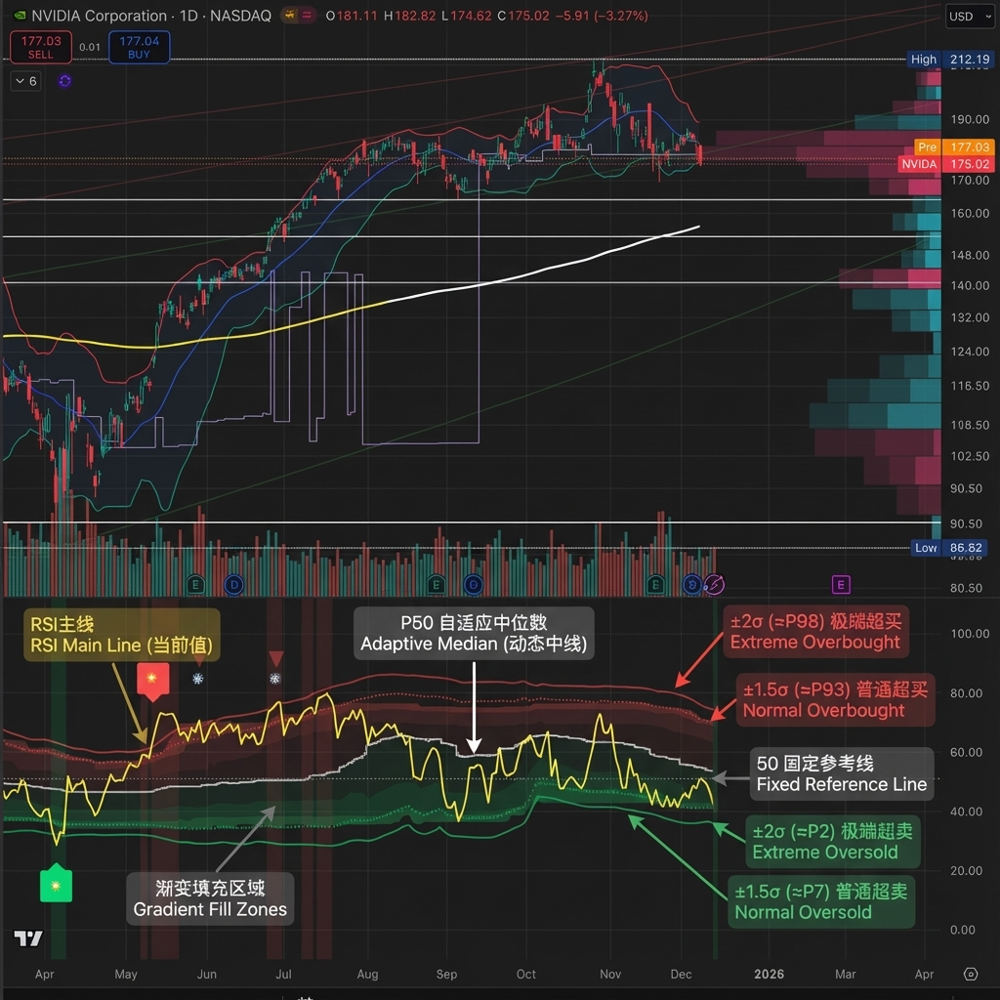

# Adaptive RSI Pro

[English README / 英文说明](../README.md)

[](https://www.tradingview.com/scripts/)
[](https://www.tradingview.com/pine-script-reference/v6/)
[](https://opensource.org/licenses/MIT)
[](https://github.com/aaajiao/Adaptive-RSI-Pro/actions/workflows/pine-lint.yml)

**Pine Script v6** | **v7.5**

一个把超买/超卖阈值适配到每只资产自身统计分布的 RSI：给每个信号打分，持续跟踪这些信号的真实历史表现，只在某类信号被证明确有历史优势时才推送警报。



## 目录

- [它是什么](#它是什么)
- [快速上手](#快速上手)
- [读懂仪表盘](#读懂仪表盘)
  - [读懂 Ranking 排行榜](#读懂-ranking-排行榜)
- [信号与图例](#信号与图例)
- [警报](#警报)
- [统计引擎与门槛](#统计引擎与门槛)
- [用策略报告版回测](#用策略报告版回测)
- [已知限制](#已知限制)
- [开发与验证](#开发与验证)
- [许可证](#许可证)

---

## 它是什么

传统 RSI 用固定的 30/70 阈值，但不同资产处在不同的波动率环境里——一只走势平缓的 ETF 上的 30 和一个加密货币对上的 30 完全是两回事。这个指标改用 **Z-Score** 来衡量当前 RSI 在该资产**自身历史 RSI 分布**中的位置：

| Z-Score | 百分位 | 含义 |
|---------|--------|------|
| ±2σ | ≈ P2 / P98 | 极端区 |
| ±Nσ | 动态 | 普通超买/超卖参考线（N 随波动率自适应） |

在自适应阈值之上，它还叠加了多周期共振、背离检测、周线趋势保护、逐信号质量评级，以及一个按各信号类型实测历史优势来门控警报的统计引擎。

项目包含两个文件：

- **`adaptive_rsi.pine`** —— 生产指标，这是产品本身。
- **`adaptive_rsi_strategy_harness.pine`** —— 围绕同一套信号引擎自动生成的 `strategy()` 包装，用于在 TradingView 策略测试器中验证信号。见[用策略报告版回测](#用策略报告版回测)。

---

## 快速上手

### 1. 添加指标

1. 打开 TradingView，进入 Pine Editor。
2. 粘贴 `adaptive_rsi.pine` 的全部内容。
3. 点击 **Add to chart（添加到图表）**。

### 2. 设置警报

1. 右键指标，选择 **Add Alert（添加警报）**。
2. 条件选 **Any alert() function call（任何 alert() 函数调用）**。
3. 可选：开启 `Include Risk Hints in Alerts`，每条消息会附带基于 ATR 的止损/止盈建议。
4. 可选：开启 `Alert on Bar Close`，警报只在 K 线收盘确认后触发（避免盘中重绘，代价是收到得更晚）。

### 3. 推荐预设

| 场景 | Dashboard | Normal Signals | Protection Level | Filter Mode |
|------|-----------|----------------|------------------|-------------|
| 日内交易 | Full | Smart | Moderate | Alert Only |
| 波段交易 | Full | Off | Moderate | Hard |
| 手机盯盘 | Mobile | Off | Loose | Alert Only |

### 4. Filter Mode 怎么选

- `Alert Only` —— 最佳默认：所有信号都留在图上，但只有过了门槛的信号才会推到你手机上。
- `Soft` —— 保留完整图表上下文，未通过的信号在视觉上弱化显示。
- `Hard` —— 只显示历史上合格的信号，图面最干净。

---

## 读懂仪表盘

### Full 模式（桌面端）

在 `Stats Mode = Ranking`、默认 `Edge vs Baseline` 门槛下，面板长这样：

```text
┌────────────────────────────────────────────┐
│ ADAPTIVE RSI                          35.2 │
├────────────────────────────────────────────┤
│ Z-Score              -2.15σ (≈P2)          │
│ Percentile           P5 (−1.5σ ~ −2σ)      │
│ Signal               🔥[A]✓                │
│ Status               🟢 EXTREME OVERSOLD   │
│ Protection [Moderate] ✓ W.RSI:45 📊↑       │
│ Lookback [Auto]      456↑(150-800) ✅✅✅   │
│ Normal [Smart]       ⬆️1.50σ ✓             │
├────────────────────────────────────────────┤
│ MTF 60|240|D         🟢|⚪|–               │
│ Resonance            🟢 3/4 ⚠️             │
│ Divergence [Normal]  🟢 BULL (5/60)        │
├────────────────────────────────────────────┤
│ ── RANKING ──        (20b) Base→Req        │
│                      ⬆62→67%|⬇38→43%       │
│ 🌟[A]📈(28)✓         +3.2%|71%             │
│                      (+8.6pp|+2.3%)        │
│ 💎[B]📉(21)✓         +1.8%|46%             │
│                      (+7.9pp|+2.7%)        │
└────────────────────────────────────────────┘
```

### 逐行说明

| 行 | 内容 |
|----|------|
| **Z-Score** | 当前 RSI 的 Z-Score 及近似百分位（`≈P2`）。百分位标签按正态分布假设换算，只是显示近似，不是精确排名。 |
| **Percentile** | RSI 在回看窗口里的实际分位档（P5/P10/P25/P50/P75/P90/P95/P99），附对应的 σ 区间。 |
| **Signal** | 当前信号图标 + 质量等级 + 过滤标记，如 `🔥[A]✓`。无新信号时显示持续状态文字，如 `🔥持续`（仍处极端区）或 `超卖区`（处于普通超卖区）。 |
| **Status** | 当前区域：`🟢 EXTREME OVERSOLD`、`🟡 OVERSOLD`、`⚪ NEUTRAL`、`🟠 OVERBOUGHT`、`🔴 EXTREME OVERBOUGHT`。 |
| **Protection** | 周线趋势过滤状态——`✓` 双向放行、`BUY✓` / `SELL✓` 只放行一个方向、`⚠️` 双向拦截、`OFF` 已关闭——外加周线 RSI 数值和成交量图标（`📊↑` 放量、`📊↓` 缩量、`📊` 正常）。 |
| **Lookback** | `[Auto]` 或 `[Custom]` 模式；当前自适应样本窗口及允许范围，如 `456(150-800)`。数字后跟 `↑` 表示分布反馈加成已启用（RSI 分布过窄 → 拉长窗口）。三个图标是健康检查——样本覆盖、分布宽度、统计有效性——各自显示 `✅`（正常）或 `⚠️`（降级）。 |
| **Normal** | 普通信号模式 `[Smart]`/`[On]`/`[Off]` 及当前动态阈值，如 `⬆️1.50σ ✓`（生效）或 `1.50σ ✗`（被 Smart 模式抑制），关闭时显示 `—`。 |
| **MTF** | 各周期 RSI 状态：`🟢` 超卖、`🔴` 超买、`⚪` 中性、`–` 该周期无可用数据。 |
| **Resonance** | 有效数据周期中有多少个方向一致，如 `🟢 3/4`。末尾的 `⚠️` 表示至少有一个周期没有数据（仅作显示提醒，不改变共振计算）。 |
| **Divergence** | 当前背离模式（自动或自定义）、`🟢 BULL` / `🔴 BEAR` / `—`，以及正在使用的（回看/范围）参数。 |

### Mobile 模式

只有三行：

```text
┌─────────────────┐
│  RSI      35.2  │
│  Signal   🔥[A]✓│   信号 + 等级 + 标记
│  Status   🟢极卖 │   仅显示区域
└─────────────────┘
```

### 读懂 Ranking 排行榜

`Stats Mode = Ranking` 时，仪表盘变成一张**信号类型 × 质量等级 × 方向**的排行榜（共 32 个桶），直接告诉你哪些组合在这张图上真的管用。这是面板上信息密度最高的部分，下面逐个元素拆开讲。

默认 `Edge vs Baseline` 模式下的典型面板：

```text
── RANKING ──      (20b) Base→Req
                   ⬆62→67%|⬇38→43%
🌟[A]📈(28)✓       +3.2%|71%
                   (+8.6pp|+2.3%)
💎[B]📉(21)✓       +1.8%|46%
                   (+7.9pp|+2.7%)
🔥[B]📈(35)✓       +1.6%|68%
                   (+5.7pp|+0.7%)
⬆️[C]📉(9)⚠️       +0.6%|39%
                   (+1.2pp|+0.7%)
🔥[D]📈(12)⚠️      -0.8%|60%
                   (-2.4pp|-1.0%)
```

#### 表头

`(20b)` 是前瞻窗口：每个样本衡量的都是信号后 **20 根 K 线**的价格表现（`Forward Bars`，默认 20）。

`⬆62→67%` 读作：买方向的**无条件基准胜率**是 62%——在这张图的任意一根 K 线上买入、20 根之后上涨的概率——而一个买入桶需要**调整胜率达到 67%** 才能通过警报门槛的胜率路径（v7.5 起，在默认 `Payoff Gate = Either Edge` 下，桶也可以改走收益路径通过——见[统计引擎](#统计引擎与门槛)）。要求 = `基准 + (Min Adjusted WinRate − 50)`，默认 `Min Adjusted WinRate = 55`，即基准 +5 个百分点，并钳制在 25–90% 之间，防止极端基准让门槛变得不可满足或形同虚设。`⬇38→43%` 是卖方向的同一套读法。

`Base→Req` 表头在两种门槛模式下都会显示；`Absolute (Legacy)` 模式下 `Req` 就是固定的绝对门槛。

#### 逐行拆解

左格——`🌟[A]📈(28)✓`：

- **信号类型 emoji**：`🌟` MTF 共振、`💎` 背离+极端、`🔥` 极端、`⬆️` 普通。这一列的类型 emoji **不分方向**——方向只看下一个元素。
- **`[A]`** —— 质量等级 A–D。
- **`📈`/`📉`** —— 买入桶或卖出桶。
- **`(28)`** —— 有效样本数（经时间衰减后）。
- **可靠性标记**：`✓` 有效样本 ≥ 20，`⚠️` ≥ 5。

右格第一行——`+3.2%|71%`：

- **平均前瞻收益**。`📉`（卖出）行口径翻转：数字衡量的是信号后价格**下跌**了多少，正数 = 卖对了。
- **调整胜率** —— 原始胜率向该桶自身方向的基准收缩后的值（见[统计引擎](#统计引擎与门槛)）。

右格第二行——`(+8.6pp|+2.3%)`：

- **胜率优势**：调整胜率 − 本方向基准，单位是百分点。这是排序键。
- **收益优势**：该桶的平均前瞻收益减去本方向基准的平均前瞻收益，再乘以与胜率相同的置信度收缩因子（见[统计引擎](#统计引擎与门槛)）。正数 = 这个桶的信号不止会发生，还比随机入场**赚得更多**。
- 第二行仅在 `Edge vs Baseline` 模式下显示；`Absolute (Legacy)` 模式下右格只有一行，排序改按绝对调整胜率。

#### 核心读法：比 pp，不比胜率

把胜率想成"考了多少分"，把 Base 想成"这张卷子的平均分"——只有**超出平均分**的部分才是信号自己挣的。

在一只上涨的资产里，随便买胜率本来就有 62%（顺风），随便卖只有 38% 是对的（逆风）。所以 68% 的买入胜率和 46% 的卖出胜率**不能直接比**。算笔账：100 次随机买能赢 62 次，`🔥[B]📈` 这个桶 68% 的胜率只多赢 6 次（+5.7pp）；100 次随机卖只对 38 次，`💎[B]📉` 这个桶 46% 却多对了 8 次（+7.9pp）——看起来更"差"的卖出桶，反而携带了更多信息。

如果排行榜按绝对胜率排，上涨资产里所有买入桶会挤满榜首、所有卖出桶沉底——榜单测的就成了"这只股票在涨"，而不是"哪种信号好用"。（这是 v7.3 的实际缺陷，同一个口径问题也导致卖出警报被系统性过滤掉。）Edge 排序和警报门槛用的是同一把尺：门槛要求终身样本数 ≥ `Min Samples`（默认 20），**且**具备质量优势——胜率优势至少 +5pp（默认），或在 v7.5 起的默认 `Payoff Gate = Either Edge` 下改以收益优势 ≥ `Min Payoff Edge %` 通过。

#### 胜率优势 vs 收益优势

第二行的两个数字回答的是不同的问题。**胜率优势**（`pp`）问的是：这个信号是不是比随机入场赢得**更频繁**？**收益优势**（`%`）问的是：它每笔是不是比随机入场赚得**更多**？一个桶完全可以挂掉一条路、通过另一条。

举个实例：某张图的买方向基准胜率 62%，随机入场的 20 根 K 线平均收益 +0.9%。有个桶胜率只有 58%——即 **−4pp**，胜率路径不通过——但它的平均前瞻收益是 **+2.1%**，对比基准的 +0.9%，收缩后收益优势为 **+1.2%**（满置信度下），轻松越过默认的 `Min Payoff Edge % = 0.4`。这个桶**赢得更少，但赢时赢得更大**——这正是趋势资产上均值回归入场的典型形态：少数深度回调的成交捕获了超额反弹。在默认 `Payoff Gate = Either Edge` 下，这个桶能通过门槛。

反过来才是要警惕的情形：当**两个**优势都为负——赢得更少、赚得也比随机差——这个桶是真死了，怎么读数字都救不回来。

#### 负 pp 意味着什么

负优势意味着：跟着这个信号买，胜率反而**低于随机买**——它专挑比平均更差的时机。这里很容易看走眼：模拟面板里 `🔥[D]📈` 显示 60% 的胜率，对着 50% 这条天真的及格线看似乎还不错——但基准是 62%，它比瞎买还**差 2.4 个百分点**（胜率按整数显示，面板上的 `(-2.4pp)` 才是精确优势值）。机制上，这种情况常见于极端超卖信号总在动量崩塌的中段触发（接飞刀）。从 v7.5 起，负 pp 不再是单指标一票否决——丢弃一个负 pp 桶之前，先看同一行的收益优势数字，因为"赢得更少、赢时更大"的桶仍可能携带真实的收益优势（这里 `🔥[D]📈` 显示 `-1.0%`，两个优势都为负，这个桶是真不行）。

这也是分桶的意义所在：同一信号类型在不同等级下符号可能相反——`🔥[A]📈` 可以是 +6pp，而 `🔥[D]📈` 是 −2.4pp。

碰到负优势的桶怎么办：

- 门槛的胜率路径会拦下它，所以在默认 `Either Edge` 下它只有收益优势越过 `Min Payoff Edge %` 时才会触发警报——也就是说，负 pp 还能报警的桶必然是"赢得更少、赢时更大"型。若设 `Payoff Gate = Off` 或 `Both Edges`，它永远不会触发警报。
- 如果它仍出现在图上（比如 `Alert Only` 模式），当噪音处理。
- 不要反着做：反向交易要对照的是**另一个方向**的基准，换算并扣除成本后通常没有剩余优势。
- 收缩会把小样本拉向基准，真实的负优势可能比显示的更深。
- 只有当一个桶达到 `✓` 可靠性且持续为负，才算可靠的"此路不通"结论。

#### "No timing edge" 行

当整个*方向*都失效时，面板会明说。统计表头正下方会出现这样一行：

```text
⬆️ No timing edge  无择时优势·趋势市?
```

（橙色，每个方向至多一行，仅 `Edge vs Baseline` 模式显示。）触发条件是：该方向至少有 **2 个有数据的桶**（有效样本数 ≥ 5），且**全部**桶的胜率优势为负、收益优势不为正。换句话说：这个方向上没有任何信号比随机赢得更频繁，也没有任何信号赢得更大。

这种形态是趋势市的特征——强劲上涨中，均值回归式的买入择时相对于一直持有没有任何增益（下跌趋势对卖出方向同理）。怎么应对：不要在这个标的/周期上对该方向做逆势择时入场；警报门槛本来就会拦下这些信号，图上若仍有残留（如 `Alert Only` 模式），当噪音处理。提示读取的就是门槛读取的那组桶（当前 `Stats Mode`），所以切换 `Stats Mode` 可能改变它是否触发。和统计面板里的一切一样，它描述的是已加载的历史——行情切换后，它只会随新样本的积累逐渐消退。

#### 两个边界

1. **优势高 ≠ 期望收益高。** 46% 的胜率仍然意味着 54% 的概率做错——逆势终归是逆势。平均收益列已经把输掉的次数摊进去了，所以两列要一起看：胜率回答"这个信号懂不懂行情"，平均收益回答"它赚不赚钱"。
2. **基准本身会动。** 它取决于实际加载了多少图表历史，也随时间衰减漂移，行情切换之后每个优势值的含义都会刷新。小样本桶的调整胜率被收缩向基准、优势被压向 0——这是有意设计，不让小样本吹牛。

#### 显示规则

- 最多显示 **8 行**。
- 有效样本不足 5 的桶不显示；如果没有任何桶达标，面板显示 `No data yet / Need ≥5 signals`。
- 负优势桶照常显示，自然沉到榜单底部。

#### 其他统计模式

`Stats Mode = Signal Type` 只按信号类型聚合（标签与警报图标一致，8 个桶）；`Grade` 只按质量等级聚合（`[A]📈` 风格标签，8 个桶）。两者用同样的表头和同样的门槛；`Ranking` 是完整交叉，也是推荐默认值。

---

## 信号与图例

### 买入信号（显示在副图下沿）

| 图标 | 名称 | 条件 | 优先级 |
|------|------|------|--------|
| 🌟 | MTF 共振 | 多周期超卖共振 + Z < −2σ | ★★★★★ |
| 💎 | 背离+极端 | 极端超卖区内出现看涨背离 | ★★★★☆ |
| 🔥 | 极端超卖 | Z-Score 下破 −2σ（约 P2） | ★★★☆☆ |
| ⬆️ | 普通超卖 | Z-Score 下破 −Nσ（动态阈值） | ★★☆☆☆ |
| ↗️ | 看涨背离 | 价格创新低而 RSI 没有 | ★☆☆☆☆ |

### 卖出信号（显示在副图上沿）

| 图标 | 名称 | 条件 | 优先级 |
|------|------|------|--------|
| 🌟 | MTF 共振 | 多周期超买共振 + Z > +2σ | ★★★★★ |
| 💎 | 背离+极端 | 极端超买区内出现看跌背离 | ★★★★☆ |
| ❄️ | 极端超买 | Z-Score 上破 +2σ（约 P98） | ★★★☆☆ |
| ⬇️ | 普通超买 | Z-Score 上破 +Nσ（动态阈值） | ★★☆☆☆ |
| ↘️ | 看跌背离 | 价格创新高而 RSI 没有 | ★☆☆☆☆ |

> **优先级规则**：同一根 K 线上多个条件同时成立时，只显示优先级最高的那个信号。

### 状态图标

| 图标 | 状态 | Z-Score 区间 |
|------|------|--------------|
| 🟢 | 极端超卖 | Z < −2σ |
| 🟡 | 超卖 | −2σ ≤ Z < −Nσ* |
| ⚪ | 中性 | −Nσ ≤ Z ≤ +Nσ |
| 🟠 | 超买 | +Nσ < Z ≤ +2σ |
| 🔴 | 极端超买 | Z > +2σ |

> *N 是由波动率推导的动态普通阈值：高波动市场约 1.0σ，极平静市场可到 1.8σ（中间档位为 1.28σ 和 1.5σ）。`On` 模式下改用手动阈值。

### 质量等级

每个信号都带一个多因子评分得出的等级：

| 等级 | 分数 | 解读 |
|------|------|------|
| [A] | ≥80 | 高质量，可交易 |
| [B] | 60–79 | 良好，可交易 |
| [C] | 40–59 | 一般，谨慎参与 |
| [D] | <40 | 低质量，通常跳过 |

**评分怎么算**（以买入方为例，卖出方完全镜像）：

- 处于极端区（|Z| > 2σ）打底 **+50**
- 深度加分：|Z| > 2.5σ 加 **+20**，否则 |Z| > 2σ 加 **+10**
- 出现背离**或** MTF 共振 **+25**（单次加分——两者不叠加）
- 极端区内 RSI 拐点确认 **+10**
- 周线趋势同向 **+15**
- 放量 **+10**（开启成交量评分时）
- 周线反向极端 **−20**（例如在周线极端下跌趋势里抄底）
- 异常缩量 **−10**
- 任一统计健康检查失败 **−15**（样本覆盖 / 分布宽度 / 统计有效性）
- ADX 逆势惩罚 **−10**（强趋势与信号方向相反）
- 最低 0 分

### 显示标记

| 标记 | 含义 | 备注 |
|------|------|------|
| ✓ | 通过统计过滤 | 出现在仪表盘信号行和警报消息中 |
| ⚠️ | 未通过统计过滤但仍显示 | 常见于 `Alert Only` 或 `Soft` 模式 |
| 🚫 | 信号存在但被隐藏 | 由 Smart 普通信号隐藏、趋势保护或 `Hard` 过滤导致 |
| （无） | 非触发 K 线，或统计过滤已关闭 | 例如 `🔥持续` 这类持续状态文字 |

> 警报只为通过统计过滤的信号触发——警报文本里只会出现 `✓` 或无标记，永远不会出现 `⚠️`。

---

## 警报

一条聚合警报覆盖所有信号类型。用 **Any alert() function call** 创建一次，所有过了门槛的信号都会汇入同一条消息流。

### 消息结构

```text
AAPL: 🟢 BUY → 🌟MTF共振 | RSI:25.3 Z:-2.1σ (≈P2) [A]✓
AAPL: 🔴 SELL → ❄️极端 | RSI:78.5 Z:2.3σ (≈P98) [B]✓
```

- **方向**：`🟢 BUY` / `🔴 SELL`
- **信号图标**：`🌟MTF共振`（共振）、`💎背离`（背离）、`🔥极端` / `❄️极端`（极端）、`⬆️超卖` / `⬇️超买`（普通）
- **可选后缀**：`✓确认`（RSI 拐点确认）、`↩反转`（Z-Score 从极端区回穿）、`⚡实时背离`（实时背离形成中）
- **上下文**：RSI 数值、Z-Score、近似百分位、质量等级、过滤标记

开启 `Include Risk Hints in Alerts` 后：

```text
AAPL: 🟢 BUY → 🔥极端 ✓确认 ⚡实时背离 | RSI:25.3 Z:-2.1σ (≈P2) [A]✓ | SL:-1.5% TP:+3.0%
```

### 风险提示

止损基于 **ATR(14)**，按信号等级缩放：

| 等级 | 止损距离 |
|------|----------|
| A | 2.5 × ATR |
| B | 2.0 × ATR |
| C | 1.5 × ATR |
| D | 1.2 × ATR |

止盈 = 止损距离 × `Risk-Reward Ratio`（默认 2.0，范围 1.5–3.0）。卖出信号符号翻转（`SL:+x% TP:-y%`）。

### 触发时机

`Alert on Bar Close`（默认关）把警报推迟到 K 线收盘确认：不再有盘中闪现又消失的信号（重绘），代价是收到得更晚。关闭则保持盘中即时触发。

### 哪些信号能推送出来

警报只为通过统计门槛的信号触发，**所有**过滤模式下都一样——`Alert Only` 在图上不过滤任何信号，但警报流始终是被门控的。同一根 K 线上的去重只放行更高优先级的升级信号再次触发。

---

## 统计引擎与门槛

这套机制是 `✓` 标记的含义来源。用大白话讲：

**记录什么。** 每次信号发生都按前瞻收益计分——`Forward Bars`（默认 20）根 K 线后价格的表现。买入样本记录涨幅；卖出样本记录**跌幅**，所以正数永远表示"信号判断正确"。样本按 `Stats Mode` 落桶：按信号类型、按等级，或按类型 × 等级 × 方向的完整交叉（`Ranking`）。另有两个无条件基准桶（买/卖）记录**每一根** K 线的前瞻收益，为每个方向提供"随机入场"的对照基准——既包括基准**胜率**，也包括基准**平均收益**（即漂移）。

**贝叶斯调整。** 小样本的原始胜率会说谎。每个桶的胜率向先验收缩：`adjusted = prior + confidence × (raw − prior)`，其中 `confidence = min(1, 有效样本数 / 20)`。`Edge vs Baseline` 模式下先验是该桶自身方向的基准；`Absolute (Legacy)` 模式下是 50%。终身样本数不足 5 的桶不报告任何调整胜率。

**收益优势。** 把同一套反夸大处理用在收益而不是胜率上：`收益优势 = confidence ×（桶平均前瞻收益 − 方向基准平均收益）`，置信度因子与调整胜率完全相同，"终身样本数不足 5 不报告数值"的规则也完全相同。减去方向基准就扣掉了资产自身的漂移，剩下的就是信号的**择时贡献**（以前瞻窗口收益百分比计）；收缩会把小样本桶和陈旧桶的优势拖向 0，让它们没法吹牛。

**时间衰减。** `Stats Half-Life Bars`（默认 1500，`0` = 关闭）让样本权重随时间指数衰减——1500 根 K 线在日线上约 6 年、4 小时图上约 9 个月，足以覆盖一个完整周期，同时让旧行情淡出。衰减只影响**有效**样本数（进而影响置信度）；`Min Samples` 门槛始终按未衰减的终身样本数判断，所以稀有信号桶不会被永久锁死。

**独立采样。** `Independent Samples`（默认开）让每个桶在记录一个样本后至少等 `Forward Bars` 根 K 线再记录下一个，避免前瞻收益窗口重叠虚增样本数。关闭则恢复旧版重叠采样行为。

**门槛。** 信号通过需要同时满足两条：

1. 终身样本数 ≥ `Min Samples`（默认 20）——**所有**模式与组合下都必须满足；下面的任何路径都不能替代样本充分性——且
2. 质量判定。

质量判定有两条可能的路径：

- **胜率路径**：调整胜率 ≥ 要求水平。要求水平取决于 `Gate Mode`：
  - **`Edge vs Baseline`**（默认）：要求 = 方向基准 + (`Min Adjusted WinRate` − 50)。默认 55 即**基准 +5pp**，钳制在 **25–90%**。设立它的原因是：绝对门槛会在趋势资产上系统性拒绝卖出桶——当随机卖出只有 38% 胜率时，45% 的卖出胜率可以是货真价实的强优势（见[排行榜阅读指南](#读懂-ranking-排行榜)）。
  - **`Absolute (Legacy)`**：要求 = `Min Adjusted WinRate` 作为固定绝对门槛，先验 = 50%。
- **收益路径**（v7.5）：收益优势 ≥ `Min Payoff Edge %`（默认 **0.4**，范围 0–10，步长 0.1）。漂移已经通过基准扣除，所以这个门槛只需要对抗估计噪声——建议区间 0.3–0.5。收益路径**仅在 `Gate Mode = Edge vs Baseline` 时生效**；`Absolute (Legacy)` 下门槛永远只看胜率。

两条路径如何组合由 **`Payoff Gate`** 决定（选项 `Off` / `Either Edge` / `Both Edges`，默认 **`Either Edge`**）：

- **`Off`** —— 只走胜率路径：与 v7.4 门槛完全一致。
- **`Either Edge`**（默认）—— 任一路径通过即可。它会放行"赢得更少、赢时更大"的桶——趋势资产上均值回归信号的典型形态——因此这是**相对 v7.4 的行为变化**：一些 v7.4 会拦下的桶现在会触发警报。设 `Payoff Gate = Off` 可回退。
- **`Both Edges`** —— 两条路径都必须通过；比 v7.4 更严格。

**过滤模式**决定未过门槛的信号怎么处理：

| 模式 | 图表 | 警报 |
|------|------|------|
| `Alert Only` | 所有信号可见 | 过滤 |
| `Soft` | 未通过的信号视觉降级 | 过滤 |
| `Hard` | 未通过的信号隐藏 | 过滤 |

> **还原 v7.4 门槛行为**：设 `Payoff Gate = Off`。门槛判定即与 v7.4 完全一致（排行榜的收益优势数字和 "No timing edge" 提示只是显示层，在 Edge 模式下仍会出现）。
>
> **还原 v7.3 统计行为**：设 `Stats Half-Life Bars = 0`、关闭 `Independent Samples`、设 `Gate Mode = Absolute (Legacy)`（后者本身就会停用收益路径，无论 `Payoff Gate` 设成什么），即可精确还原旧版统计引擎的算法。但 v7.4 有两处信号层改动**没有回退开关**——回看窗口分布因子的滞回区间（spread 低于 18 启用、高于 22 释放）和冷却过期级别重置——所以记录到的信号流（进而门槛判定）仍可能与 v7.3 有细微差异。

**冷却与升级。** 高优先级信号（🌟/💎/🔥/❄️）使用 1 根 K 线的冷却。普通信号按 `Cooldown Mode` 设置：`Smart`（按波动率取 2–8 根，市场活跃时再缩短 1 根）或 `Fixed`（固定冷却期，默认 5 根）。更高优先级的同向信号可以绕过冷却——`⬆️ → 🔥 → 🌟` 可以在连续 K 线上依次触发。升级豁免只跟**仍在冷却中**的前一个信号比较；冷却已过期的级别按 0 计，所以普通信号永远无法用自己的过期级别绕过自己的冷却。

---

## 用策略报告版回测

### 它是什么——以及不是什么

`adaptive_rsi_strategy_harness.pine` 是**由生产指标自动生成**的 `strategy()` 包装（由 `tools/generate_strategy_harness.py` 生成——从不手工编辑），信号引擎与指标完全一致。它只回答一个问题：v7.5 的信号引擎放进 TradingView 策略测试器里表现如何？

它是**门控信号回测**，不是逐笔 `alert()` 投递的精确模拟：它不建模警报调度和送达次数。用它评估信号与过滤路径，不要拿它对账警报日志。

另外要分清两套口径：指标的统计是固定时长的**前瞻收益**统计（信号质量），而策略报告版给出的是 `strategy()` 执行规则下的已实现交易（执行结果）。两者相关，但永远不是同一个数字——不要拿策略胜率直接对比指标的调整胜率。

### 设置

1. 在 Pine Editor 中新开一个脚本。
2. 粘贴 `adaptive_rsi_strategy_harness.pine` 并添加到图表。
3. 打开 **Strategy Tester（策略测试器）** 标签页。

### 输入项

| 输入项 | 默认值 | 作用 |
|--------|--------|------|
| `Trade Side` | `Long Only` | `Long Only`：只开多，卖出信号平多。`Short Only`：只开空，买入信号平空。`Both`：反向信号直接反手。 |
| `Backtest Mode` | `Production` | `Baseline`：交易原始信号，不加统计过滤。`Production`：只交易过了门槛的信号——和警报用的是同一个门槛。 |
| `Use ATR SL/TP Exits` | 关 | 按警报展示的同一套 ATR 止损/止盈价格离场。价格在信号 K 线收盘时快照（入场单在下一根 K 线开盘成交）；离场单与入场单同时下达并通过 `from_entry` 绑定，所以从入场成交那根 K 线起仓位就受保护。关闭 = 只在反向信号时平仓。 |
| `Max Holding Bars` | `0`（关） | 持仓满 N 根 K 线后强制平仓（时间退出）——平仓单在第 N−1 根持仓 K 线收盘时下达，下一根 K 线开盘成交。 |

### 读结果

TradingView 始终显示 `All`、`Long`、`Short` 三列。**按 `Trade Side` 解读 `All`**：`Long Only` 时它就是你的纯多结果；`Short Only` 时是纯空结果；`Both` 时是合并结果。仪表盘的 `Tester` 行会重复这条规则。

策略报告版在仪表盘上多加三行：

- `Harness` —— 当前的 `Trade Side` 和 `Backtest Mode`
- `Tester` —— `All` 列该怎么读
- `Production Gate` —— 当前信号在 `Stats Mode` 下实际选中的统计桶，附样本数、平均收益、调整胜率，以及（`Edge vs Baseline` 模式下）收缩后收益优势，例如 `Ranking` 模式下的 `EXT[A](12) +2.8%|67%|+1.2%`（`Signal Type` 模式显示 `TYPE:EXT`，`Grade` 模式显示 `GRADE[A]`；无信号时显示 `Idle`；`Absolute (Legacy)` 模式下不带收益后缀）。

### 成本

策略报告版默认声明**手续费 0.05%**、**滑点 2 跳（ticks）**。两者都可以在 **Strategy Tester → Properties** 里直接覆盖——不需要改代码。

### 推荐流程

1. 先用 `Trade Side = Long Only`。
2. 跑 `Backtest Mode = Baseline` —— 原始信号引擎在这个标的上有没有优势？
3. 切到 `Backtest Mode = Production` —— 警报门槛让结果变好还是变差？
4. 换几个标的重复；推荐从 `GOOGL 1D`、`AAPL 1D`、`BTCUSDT 4H` 开始。

---

## 已知限制

- **统计依赖历史数据量**：所有信号统计都基于 TradingView 实际加载的图表历史计算，所以门槛判定可能因订阅档位、标的不同而不同，甚至同一标的的不同会话之间也会有差异。
- **样本重叠偏差**：`Independent Samples` 能缓解前瞻收益窗口重叠的问题，但无法完全消除样本重叠偏差。
- **低周期 MTF 覆盖**：低于图表周期的 MTF 数据只覆盖最近约 1400 根图表 K 线（`MAX_REQUEST_BARS`），所以深历史区段的 MTF 共振信号会稀疏。
- **盘中重绘**：除非开启 `Alert on Bar Close`，盘中信号可能在收盘前出现又消失。
- **百分位标签是近似值**：Z-Score 换算的百分位标签（如 `≈P2`）基于正态分布假设，只是显示近似，不是精确排名。
- **策略报告版的边界**：它是门控信号回测，不是逐笔 `alert()` 投递的精确模拟。

---

## 开发与验证

源码：[github.com/aaajiao/Adaptive-RSI-Pro](https://github.com/aaajiao/Adaptive-RSI-Pro)

本地检查（自研 Pine Script 静态分析器、生成文件漂移检查、Python `unittest` 测试套件；CI 在每次涉及 `.pine` 文件或工具链的 push/PR 上跑同样的检查）：

```bash
python3 tools/generate_strategy_harness.py --check
python3 tools/pine_linter/cli.py --config .pine-lint.yml adaptive_rsi.pine
python3 tools/pine_linter/cli.py --config .pine-lint.yml adaptive_rsi_strategy_harness.pine
python3 -m unittest discover -s tests -v
```

修改生产逻辑后，用 `python3 tools/generate_strategy_harness.py` 重新生成策略报告版——永远不要手工编辑它。

TradingView 验证：把两个脚本分别粘进 Pine Editor，至少在 **GOOGL 1D**、**AAPL 1D**、**BTCUSDT 4H** 上确认编译和运行行为。

---

## 许可证

[MIT](../LICENSE)
