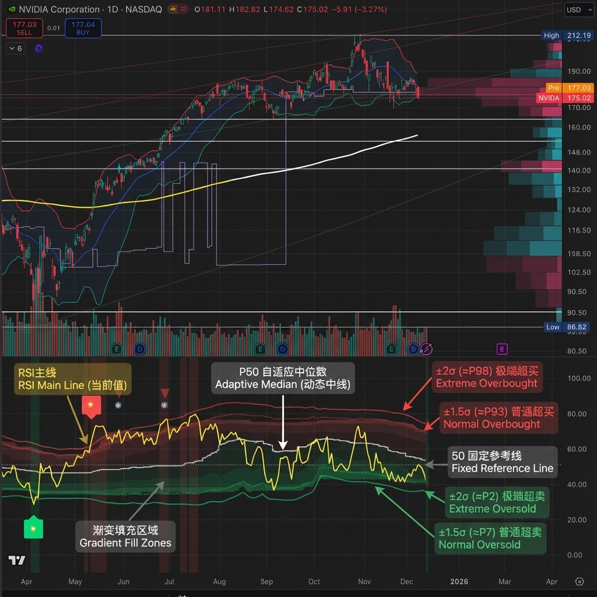

# Adaptive RSI Pro

[English README / 英文说明](../README.md)

[](https://www.tradingview.com/scripts/)
[](https://www.tradingview.com/pine-script-reference/v6/)
[](https://opensource.org/licenses/MIT)
[](https://github.com/aaajiao/Adaptive-RSI-Pro/actions/workflows/pine-lint.yml)

**Pine Script v6** | **v7.7**

一个把超买/超卖阈值适配到每只资产自身统计分布的 RSI：给每个信号打分，跟踪它们在已加载历史中的表现，再按可配置的样本与质量规则门控警报。



## 目录

- [它是什么](#它是什么)
- [快速上手](#快速上手)
- [读懂仪表盘](#读懂仪表盘)
  - [读懂 Ranking 排行榜](#读懂-ranking-排行榜)
- [信号与图例](#信号与图例)
- [警报](#警报)
- [统计引擎与门槛](#统计引擎与门槛)
- [用策略报告版回测](#用策略报告版回测)
- [已知限制](#已知限制)
- [开发与验证](#开发与验证)
- [许可证](#许可证)

---

## 它是什么

传统 RSI 用固定的 30/70 阈值，但不同资产处在不同的波动率环境里——一只走势平缓的 ETF 上的 30 和一个加密货币对上的 30 完全是两回事。这个指标改用 **Z-Score** 来衡量当前 RSI 在该资产**自身历史 RSI 分布**中的位置：

| Z-Score | 百分位 | 含义 |
|---------|--------|------|
| ±2σ | ≈ P2 / P98 | 极端区 |
| ±Nσ | 动态 | 普通超买/超卖参考线（N 随波动率自适应） |

在自适应阈值之上，它还叠加了多周期共振、背离检测、周线趋势保护、逐信号质量评级，以及一个按所选统计桶的样本状态与已测历史表现来门控警报的统计引擎。

实际目标是扣除成本后的已平仓交易胜率，同时检查回撤与平均盈亏。指标的前瞻收益估计用于筛选信号，并不是实际成交后的交易胜率。v7.7 修复数据覆盖与执行一致性，并把默认门槛改为必须具备胜率证据；这些改动不等于已经证明实盘胜率提高。

项目包含两个文件：

- **`adaptive_rsi.pine`** —— 生产指标，这是产品本身。
- **`adaptive_rsi_strategy_harness.pine`** —— 围绕同一套信号引擎自动生成的 `strategy()` 包装，用于在 TradingView 策略测试器中验证信号。见[用策略报告版回测](#用策略报告版回测)。

---

## 快速上手

### 1. 添加指标

1. 打开 TradingView，进入 Pine Editor。
2. 粘贴 `adaptive_rsi.pine` 的全部内容。
3. 点击 **Add to chart（添加到图表）**。

### 2. 设置警报

1. 右键指标，选择 **Add Alert（添加警报）**。
2. 条件选 **Any alert() function call（任何 alert() 函数调用）**。
3. 可选：开启 `Include Risk Hints in Alerts`，每条消息会附带基于 ATR 的止损/止盈建议。
4. 保持 `Alert on Bar Close` 开启（v7.7 默认），在 K 线收盘确认时作出判定。只有明确评估盘中执行时才关闭。
5. 升级后删除并重建旧警报，让 TradingView 使用新版脚本与输入设置。

### 3. 显示预设

下列预设改变显示与信号开放范围，并非经过验证的交易配置。v7.7 默认 `Payoff Gate = Off`、`Unproven Buckets = Block (Legacy)`、`Alert on Bar Close = 开`；保留 `Ranking` 与 Adaptive 证据解析。`Block (Legacy)` 的已保存选项名为兼容旧设置而保留。

| 场景 | Dashboard | Normal Signals | Protection Level | Filter Mode |
|------|-----------|----------------|------------------|-------------|
| 日内交易 | Full | Smart | Moderate | Alert Only |
| 波段交易 | Full | Off | Moderate | Hard |
| 手机盯盘 | Mobile | Off | Loose | Alert Only |

### 4. Filter Mode 怎么选

- `Alert Only` —— 最佳默认：所有信号都留在图上，但只有过了门槛的信号才会推到你手机上。
- `Soft` —— 保留完整图表上下文，未通过的信号在视觉上弱化显示。
- `Hard` —— 只显示当前门槛设置允许的信号，图面最干净。

---

## 读懂仪表盘

### Full 模式（桌面端）

下例使用 `Stats Mode = Ranking`、`Edge vs Baseline`，并主动选择 `Payoff Gate = Either Edge` 来展示两条路径。v7.7 默认是 `Payoff Gate = Off`，对应 `WR ONLY`，Avg edge 标为 `info`：

```text
┌──────────────────────────────────────────────────────────────┐
│ ADAPTIVE RSI                                               35 │
├──────────────────────────────────────────────────────────────┤
│ RSI Position          Z -2.15σ                                │
│                       History ≤P5                              │
│ Signal                🔥 EXT BUY                              │
│                       [Score A] ✗                              │
│ RSI Zone              🟢 EXTREME OVERSOLD                    │
│ Data Context          Ready                                  │
│                       Eligible since YYYY-MM-DD               │
│ Stats Filter                 BLOCK · OR (0/2)                │
│ 🔥 EXT BUY → Type          WR edge −0.10pp ✗              │
│ n=18 · target 14             Avg edge +0.10% ✗             │
│ Market Context        Trend Moderate: Both allowed              │
│                       W-RSI 45                                  │
│                       Volume: Surge (1.8×)                    │
│ Lookback [Auto]       74 bars                                 │
│ Allowed 59–400 bars   Healthy                                 │
│ Normal Signals [Smart] Active                                  │
│                       Threshold ±1.50σ                         │
├──────────────────────────────────────────────────────────────┤
│ MTF                   1h 🟢Oversold · 4h ⚪Neutral            │
│                       D 🟢Oversold                             │
│                       No resonance · 2/3 incl chart             │
│ Divergence            None · Auto / Crypto                    │
│                       Pivot 10 · Max gap 120 bars              │
├──────────────────────────────────────────────────────────────┤
│ ── WR-EDGE RANK ──    Avg edge min +0.4%                   │
│ Outcome +20 bars      BUY WR 56.10→61.10%                    │
│ OR · Adaptive n 8–16  SELL WR 44.00→49.00%                   │
│ Edge Summary          SELL: no supported edge                │
│ 🌟 MTF               PASS · OR (2/2)                        │
│ BUY [Score B]         WR edge +8.60pp ✓                       │
│ n=18 · target 13      Avg edge +2.30% ✓                      │
│ 🔥 EXT               BLOCK · OR (0/2)                       │
│ BUY [Score A]         WR edge −0.10pp ✗                       │
│ n=14 · target 12      Avg edge +0.10% ✗                      │
└──────────────────────────────────────────────────────────────┘
```

上面看到的换行，是同一个 table cell 里用 newline 分出的语义层；它们**不会**新增 Pine table row，也不会额外占用面板行容量。`Stats Filter` 和 `Edge Summary` 才是条件 table row，因此中性状态下面板仍会更短。

### 逐行说明

| 行 | 内容 |
|----|------|
| **RSI Position** | 一行完成位置解读，不再重复显示两种近似百分位。`Z -2.15σ` 是当前 RSI 距均值的标准差距离；`History ≤P5` 是它在当前回看窗口内的经验排名区间。其他区间为 `P5–P10`、`P10–P25`、`P25–P50`、`P50–P75`、`P75–P90`、`P90–P95`、`>P95`。`History` 刻意写成区间，不冒充精确百分位。 |
| **Signal** | 只显示当前 K 线上的事件。Full 模式第一行是图标 + 类型 + 方向，第二行是 `[Score A]` 和可能的门槛标记，如 `🔥 EXT BUY` / `[Score A] ✓`。Score 只是当前 setup score，不是历史 edge 结论，也不是交易许可。无事件时显示 `—`。 |
| **RSI Zone** | 持续的 RSI 区域状态：`🟢 EXTREME OVERSOLD`、`🟡 OVERSOLD`、`⚪ NEUTRAL`、`🟠 OVERBOUGHT`、`🔴 EXTREME OVERBOUGHT`。它是上下文，不代表新信号。 |
| **Data Context** | 当前信号上下文的就绪状态与已加载历史中首个符合条件的日期（`Eligible since …`）。`RSI warmup`、`Weekly warmup`、`MTF coverage / warmup` 表示具体缺口；尚无可用历史时写 `No eligible history`。起始日期不表示此后连续无缺口，也不表示已有足够已完成样本。 |
| **Stats Filter** | 只在当前真实信号事件出现时显示。左格显示证据来源、桶标签，以及门槛实际使用的样本标签。已就绪 Edge 的右格用三个短行：`PASS|BLOCK · OR|AND (k/2)`、`WR edge …`、`Avg edge …`；waiting 和 stale 状态仍保持两行。默认 `Sample Policy = Adaptive` 且 `Stats Mode = Ranking` 时，左格三行 `Stats Filter` / `🔥 EXT BUY → Type` / 父桶样本标签表示精确的“类型 × score × 方向”桶尚未就绪，因此门槛改用同方向 Signal Type 父桶及其目标；箭头就是 fallback 标记。终身样本不足时写 `ALLOW|BLOCK · WAITING / No quality verdict`；Adaptive 证据陈旧时写 `ALLOW|BLOCK · STALE / Need fresh evidence`。动作来自 `Unproven Buckets`，不是 edge 估计。纯背离写 `DISPLAY ONLY / Not an alert signal`；无当前事件时整行省略。可判定格统一用白色，因为同一 cell 可能同时有 ✓/✗；按策略放行的 waiting/stale 为黄色，按策略拦截为灰色，Fixed legacy 的 stale 为黄色，filter off/仅显示为灰色。 |
| **Market Context** | 用文字说明周线趋势保护（`Both allowed`、`BUY only`、`SELL only`、`Both blocked` 或 `Trend: Off`）、已确认周线 RSI，以及成交量评分状态（`Surge`、`Low`、`Normal` 或 `score off`）。白色表示双向可用或保护关闭，黄色表示只开放一个方向，红色表示双向拦截。这些是信号处理与评分上下文，不是入场指令。 |
| **Lookback** | 左格把模式与允许窗口分层，如 `Lookback [Auto]` / `Allowed 59–400 bars`；`[Custom]` 使用固定窗口措辞。右格显示当前值和健康状态，如 `74 bars` / `Healthy`，问题时则直接用自然语言说明；多个问题可用第三行 cell 文本。 |
| **Normal Signals** | `[Smart]`、`[On]` 或 `[Off]`；右格把运行状态与对称阈值分层，如 `Active` / `Threshold ±1.50σ`。 |
| **MTF** | 同一 cell 最多三行，显示三个配置周期及直白状态：`🟢Oversold`、`🔴Overbought`、`⚪Neutral` 或 `No data`，然后给出 `Oversold resonance`、`Overbought resonance` 或 `No resonance` 及同向数/有效计数位。`incl chart` 表示比值包含图表当前周期；所有重复周期都按时长去重，包括手动周期之间的重复。缺失数据或指标尚未暖机时显示为不可用，不视为中性。 |
| **Divergence** | 右格两行：当前结果 + 模式，如 `None · Auto / Crypto`；以及语义明确的参数，如 `Pivot 10 · Max gap 120 bars`。 |

`DATA` 表示信号上下文尚不完整：当前 RSI/分位数、已确认周线特征，或某个已启用的独立 MTF 周期尚未就绪。即使关闭统计过滤，新入场、可操作警报及信号时点样本记录也要等待数据完整。关闭趋势保护后仍需周线就绪，因为 setup score 依然使用周线特征。

### Mobile 模式

只有三行：

```text
┌────────────────────────────┐
│ RSI        35.2            │
│ Signal     🔥 EXT BUY [Score A] ✓│
│ RSI Zone   🟢极卖           │
└────────────────────────────┘
```

### 读懂 Ranking 排行榜

`Stats Mode = Ranking` 时，仪表盘按已加载历史比较**信号类型 × setup-score 档位 × 方向**的组合（共 32 个桶）。

下例使用 `Edge vs Baseline` 并主动选择 `Payoff Gate = Either Edge`；默认 `Off` 会显示 `WR ONLY`：

```text
── WR-EDGE RANK ──   Avg edge min +0.4%
Outcome +20 bars        BUY WR 56.10→61.10%
OR · Adaptive n 8–16    SELL WR 44.00→49.00%
🌟 MTF                    PASS · OR (2/2)
BUY [Score B]              WR edge +8.60pp ✓
n=18 · target 13          Avg edge +2.30% ✓
🔥 EXT                    BLOCK · OR (0/2)
BUY [Score A]              WR edge −0.10pp ✗
n=14 · target 12          Avg edge +0.10% ✗
💎 DIV                    WAIT · EXACT
SELL [Score B]             Gate → Type
n=9/13⏳                  n=18 · target 12
```

#### 表头

左侧表头 cell 依次是 `WR-EDGE RANK` / `Outcome +20 bars` / `OR · Adaptive n 8–16`；右侧是 `Avg edge min +0.4%` / BUY 胜率基准→最低要求 / SELL 胜率基准→最低要求。这是同一 table row 里的三行 cell 文本。默认 `Evidence Reference = 20` 时，`Adaptive n 8–16` 就是实际动态目标范围。关闭 `Independent Samples` 后显示 `Adaptive guard n 20`；`Sample Policy = Fixed (Legacy)` 则显示 `Fixed target n 20`。

`Outcome +20 bars` 表示每个样本衡量信号后 **20 根 K 线**的方向归一化结果（`Forward Bars`，默认 20）。它是结果观察窗口，不是样本数量要求。`BUY WR 56.10→61.10%` 表示买方向无条件基准胜率 56.10%，胜率路径最低要求 61.10%。要求 = `基准 + (Min Adjusted WinRate − 50)`，默认加 5 个百分点，再钳制在 25–90%。`SELL WR 44.00→49.00%` 同理。`Avg edge min +0.4%` 是独立的收益 edge 最低要求。

表头最后一行直接写当前规则：`OR` 对应 `Either Edge`，`AND` 对应 `Both Edges`，关闭收益门槛时写 `WR only`。`Enable Stats Filter` 关闭时则直接写 `Filter off`，右侧表头仍保留配置阈值作为参考。

`Absolute (Legacy)` 下标题改为 `WIN-RATE RANK`，左格写 `Absolute WR gate`，右格写 `Minimum WR 55.00%`。该模式使用固定绝对胜率门槛，不显示基准推导值。

#### 逐行拆解

左格——`🔥 EXT` / `BUY [Score A]` / `n=14 · target 12`：

- **类型和方向分行写明**：第一行是 `MTF`、`DIV`、`EXT` 或 `NORMAL`，第二行以 `BUY` 或 `SELL` 开头。图标只是视觉速记，例如卖出极端为 `❄️ EXT` / `SELL [Score A]`，卖出普通为 `⬇️ NORMAL` / `SELL [Score D]`。
- **`[Score A]`** 保留在方向行，表示当前 setup score 的 A–D 档位，不是该桶的历史 edge 结论，也不是交易许可。
- **`n=14 · target 12`** 是已就绪的 Adaptive 标签：不衰减终身样本 14，当前桶目标 12。达到后仍显示目标，因为不同桶可以有不同目标。
- **`n=9/13⏳`** 表示终身样本 9，当前 Adaptive 目标 13；`⏳` 表示该精确桶暂不能发布质量结论。
- **`n=18 · eff 3.7<5⏳`** 表示终身数已达当前目标，但衰减后有效权重不足 5。Adaptive 将它视为 stale，不能发布结论。Ranking 会隐藏有效权重低于 5 的行，因此这种标签只会出现在当前 `Stats Filter`、Signal Type 或 Setup Score 视图。
- `Fixed (Legacy)` 下，已就绪桶只写 `n=28`；未就绪格式为 `n=当前/B⏳`，其中 B 是固定 `Evidence Reference`；`n=28 · stale` 保留旧版仅按终身数发布结论的行为。

右格第一行——`BLOCK · OR (0/2)`：

- **`PASS` / `BLOCK`** 是可判定证据在当前设置下的最终门槛动作。
- **`OR (0/2)`** 表示 `Either Edge` 启用，两条证据路径都没达标。`OR (1/2)` 和 `OR (2/2)` 都通过；`Both Edges` 下只有 `AND (2/2)` 通过。
- **`WR ONLY`** 表示收益门槛关闭；**`ABS WR`** 表示 `Absolute (Legacy)` 使用固定胜率下限。
- `Adaptive` Ranking 行的精确桶未就绪时，历史行**不会**冒充最终 gate 动作。父桶已就绪时右格三行为 `WAIT · EXACT` / `Gate → Type` / `n=18 · target 12`；父桶也未就绪时写 `WAIT · NO VERDICT` / `Type evidence` / `n=7/10⏳`。父桶进度只作说明，其数值不会冒充精确 score 桶的历史表现。

右格第二行——`WR edge −0.10pp ✗`：

- **`WR edge −0.10pp`** 是启发式调整胜率减去同方向基准；`WR-EDGE RANK` 只按这个 edge 排序。

右格第三行——`Avg edge +0.10% ✗`：

- **`Avg edge +0.10%`** 是桶平均方向归一化前瞻结果相对同方向基准平均值的样本权重收缩差，用来与 `Min Payoff Edge %` 比较。
- edge 后面的 ✓/✗ 直接表示该路径是否达标。每条路径独占一个短行；Full 模式刻意不再重复原始 `WR` 与 `Avg`，避免用户还要重新综合。
- 面板保留足够 edge 与 Legacy 门槛小数，实际判定仍使用未舍入值。`WR ONLY` 下第三行把 Avg edge 标为 `info`；`ABS WR` 的右格保持两行，第二行显示 `WR 实际值 ≥|< 最低值 ✓|✗`。

#### 直接读法：先看动作，再看证据

已就绪 Edge 桶的右格从上到下有三行：

1. **动作与规则：**`PASS` 或 `BLOCK`，再看 `OR`、`AND`、`WR ONLY` 或 `ABS WR`。
2. **胜率频率证据：**`WR edge`，带自己的标记。
3. **平均收益证据：**`Avg edge`，带自己的标记；收益门槛关闭时则标为 `info`。

例如，第二行 `WR edge −0.10pp ✗` 与第三行 `Avg edge +0.10% ✗` 表示两条超额路径都没达标，所以第一行直接给出 `BLOCK · OR (0/2)`。

所选证据不能发布结论时，门槛会刻意停止质量解读。终身 `n` 低于当前目标时写 `ALLOW|BLOCK · WAITING / No quality verdict`；Adaptive 有效 `n < 5` 时写 `ALLOW|BLOCK · STALE / Need fresh evidence`。此时由 `Unproven Buckets` 而不是两个估计值决定动作。

统计仍启用、但 `Enable Stats Filter` 关闭时，统计行写 `FILTER OFF · ALL ALLOWED`。这里的 ALL ALLOWED 只指统计规则；数据就绪、方向冲突和执行限制仍生效。Edge 模式把描述性 `WR edge` 与 `Avg edge` 分别放在第二、第三行，不带 ✓/✗；Legacy 保持两行 `WR … · no gate`。无可用估计也保持两行，并写 `No usable estimate`；表头同时写 `Filter off`。统计总开关关闭时不会渲染历史统计行，因为没有收集统计。

两个 edge 仍回答不同问题：WR edge 问信号是否比方向基准赢得更频繁；Avg edge 问平均结果是否高于基准。例如 WR edge −4pp、Avg edge +1.2% 在 `Either Edge` 下是 `PASS · OR (1/2)`，在 `Both Edges` 下是 `BLOCK · AND (1/2)`。历史估计不保证未来表现。

#### 自适应样本策略

`Sample Policy = Adaptive` 是默认值。以下用 **B** 表示 `Evidence Reference`。每个桶只读取同方向、同 scope 的四个 peer 桶终身计数：

- Signal Type：同一方向的四种信号类型。
- Setup Score：同一方向的 A–D 四档。
- Ranking：同一方向、同一信号类型下的 A–D 四档。

设当前桶终身计数为 `nᵢ`、四个 peer 总数为 `N`，算法使用总权重为 B 的对称先验——等价于每个 peer 加 B/4 个伪计数：

```text
q = (nᵢ + B/4) / (N + B)
low  = min(B, max(5, round(0.4B)))
high = min(B, max(low, round(0.8B)))
target = round(low + (high − low) × sqrt(clamp(q, 0, 1)))
```

默认 `Evidence Reference = 20` 时，运营型终身目标因此在 **8–16** 之间动态变化。对称平滑避免空桶或早期历史直接跳到极端；高频桶目标更高，稀疏桶目标更低。计算只看 counts，绝不读取 WR、Avg、edge、PASS/BLOCK 或表现正负。

Adaptive 证据须同时满足终身 `n ≥ 该桶目标` 与有效 `n ≥ 5`。`Signal Type` 和 `Grade` 使用请求桶及其目标。`Ranking` 优先精确的“类型 × score × 方向”桶；若未就绪，则尝试同方向 Signal Type 父桶，而父桶按自己的四个 Signal Type peers 独立计算目标。两级都未就绪时保留精确桶为未判定，由 `Unproven Buckets` 决定。未就绪桶没有质量结论；默认 `Block (Legacy)` 按策略拦截，并不把陈旧估计解释成质量判定。

关闭 `Independent Samples` 会恢复重叠前瞻窗口，因此 Adaptive 的 overlap guard 会把所有终身目标保护性恢复为 **B**。`Fixed (Legacy)` 同样把 B 当作固定终身门槛，始终使用 `Stats Mode` 请求桶、不回退，并且不以有效样本新鲜度决定是否可判定。

**8–16 是运营型证据规则**，不是统计显著性检验、验证门槛、置信区间或保证。它把稀疏桶的响应速度与稳健性取舍写进规则，但不能证明信号具有持久优势。

两个用户可见的默认 20 作用不同：`Outcome +20 bars` 是前瞻结果窗口；`Evidence Reference = 20` 是 B，因此生成默认 8–16 范围。除此之外，胜率与收益 edge 的收缩权重固定为 `min(1, effective_n / 20)`。降低桶的终身目标**不会**降低这个分母。权重为 1 只表示这条启发式规则不再收缩，不表示统计上的确定性。

历史 Ranking 行始终只展示精确桶证据，不会被父桶数值替换。`WAIT · EXACT / Gate → Type …` 表示匹配的实时事件已有父桶可用；`WAIT · NO VERDICT / Type …` 显示父桶真实进度。只有当前信号的 gate 视图才真正解析到父桶。

#### Edge Summary

`Edge vs Baseline` 模式下，有一条可选行汇总方向级检查：

```text
Edge Summary     BUY: no supported edge
Edge Summary     SELL: no supported edge
Edge Summary     BUY + SELL: no supported edge
```

只会出现一个汇总 table row；BUY 和 SELL 同时符合时右格可用两行 cell 文本，仍不新增 table row。某方向要被点名，当前 `Stats Mode` 下必须至少有两个桶同时满足：（a）达到各自真实证据目标；（b）当前有效权重仍至少为 5。随后，该方向所有纳入检查的桶都必须满足 WR edge < 0 且 Avg edge ≤ 0。未达到目标或因衰减而有效权重过低的桶会被排除，不会被当成负面证据。

这条摘要只描述满足上述条件的已加载历史桶，不判断当前市场类型、不预测下一次信号，也不替代逐信号的 `Stats Filter` 判定。切换 `Stats Mode`、加载不同历史深度或改变衰减设置，都可能让摘要变化。

#### 两个边界

1. **WR edge 高不等于 `Avg` 高。** 先看最终动作，再看两条证据；频率和幅度回答不同问题。
2. **基准和有效权重都会变化。** 它们取决于已加载历史和时间衰减。旧权重淡出后，一行可能变化或消失，即使显示的终身 `n` 从不减少。

#### 显示规则

- 最多显示 **8 行**。
- Ranking 只纳入有效 `n ≥ 5` 的桶；若没有任何桶达标，面板显示 `No usable buckets / Need effective n ≥ 5`。
- WR edge 为负的桶仍可显示，只会排在更高 WR edge 的桶之后。

#### 其他统计模式

`Signal Type` 聚合类型 × 方向，左格三行可为 `🔥 EXT` / `BUY` / `n=18 · target 14`。`Grade` 聚合方向 × setup-score，左格为 `BUY` / `[Score A]` / `n=15 · target 12`，表头为 `SETUP SCORE STATS`。Ranking 是类型 × score × 方向的完整视图，左格为 `🔥 EXT` / `BUY [Score A]` / 样本标签。每种模式都从自己的四-peer scope 计算目标，并统一使用“结论先行”的三行已就绪 Edge 右格。直接 waiting/stale 判定仍保持两行；精确 Ranking 的 wait 使用三行，以便把 Type 父桶来源与进度写清。`Adaptive` 下陈旧的 `Signal Type` 或 `Grade` 行显示 `n=18 · eff 3.7<5⏳` 且没有质量结论；`Fixed (Legacy)` 保留旧的 `n=28 · stale` 行为。Ranking 继续隐藏有效权重低于 5 的桶。

---

## 信号与图例

### 买入信号（显示在副图下沿）

| 图标 | 名称 | 条件 | 优先级 |
|------|------|------|--------|
| 🌟 | MTF 共振 | 多周期超卖共振 + Z < −2σ | ★★★★★ |
| 💎 | 背离+极端 | 已确认看涨背离，且历史 pivot 位于极端超卖区 | ★★★★☆ |
| 🔥 | 极端超卖 | Z-Score 下破 −2σ（约 P2） | ★★★☆☆ |
| ⬆️ | 普通超卖 | Z-Score 下破 −Nσ（动态阈值） | ★★☆☆☆ |
| ↗️ | 看涨背离 | 价格创新低而 RSI 没有 | ★☆☆☆☆ |

### 卖出信号（显示在副图上沿）

| 图标 | 名称 | 条件 | 优先级 |
|------|------|------|--------|
| 🌟 | MTF 共振 | 多周期超买共振 + Z > +2σ | ★★★★★ |
| 💎 | 背离+极端 | 已确认看跌背离，且历史 pivot 位于极端超买区 | ★★★★☆ |
| ❄️ | 极端超买 | Z-Score 上破 +2σ（约 P98） | ★★★☆☆ |
| ⬇️ | 普通超买 | Z-Score 上破 +Nσ（动态阈值） | ★★☆☆☆ |
| ↘️ | 看跌背离 | 价格创新高而 RSI 没有 | ★☆☆☆☆ |

> **优先级规则**：面板读数跟随优先级最高的事件。同次计算中若买卖两方向同时具备可操作条件，按冲突处理，不发出新入场警报。背离要等 pivot 右侧 K 线完成后才能确认，不能把它当成在更早 pivot 价格就能成交的入场。周线趋势保护同样作用于背离入场，以及极端和普通入场。

### 状态图标

| 图标 | 状态 | Z-Score 区间 |
|------|------|--------------|
| 🟢 | 极端超卖 | Z < −2σ |
| 🟡 | 超卖 | −2σ ≤ Z < −Nσ* |
| ⚪ | 中性 | −Nσ ≤ Z ≤ +Nσ |
| 🟠 | 超买 | +Nσ < Z ≤ +2σ |
| 🔴 | 极端超买 | Z > +2σ |

> *N 是由波动率推导的动态普通阈值：高波动市场约 1.0σ，极平静市场可到 1.8σ（中间档位为 1.28σ 和 1.5σ）。`On` 模式下改用手动阈值。

### Setup score 档位

每个信号都带一个多因子 setup score。面板明确写成 `[Score A]` 至 `[Score D]`，避免与独立的历史 edge 结论混淆：

| 档位 | 分数 | 解读 |
|------|------|------|
| [Score A] | ≥80 | 当前 setup score 强 |
| [Score B] | 60–79 | 当前 setup score 较有支持 |
| [Score C] | 40–59 | 当前 setup score 混合 |
| [Score D] | <40 | 当前 setup score 弱 |

Score 只汇总当前信号条件，**不是**历史 WR/Avg edge 结论、`PASS`/`BLOCK` 动作或交易许可。应把 setup score 与统计门槛当成两类独立证据。

**评分怎么算**（以买入方为例，卖出方完全镜像）：

- 处于极端区（|Z| > 2σ）打底 **+50**
- 深度加分：|Z| > 2.5σ 加 **+20**，否则 |Z| > 2σ 加 **+10**
- 出现背离**或** MTF 共振 **+25**（单次加分——两者不叠加）
- 极端区内 RSI 拐点确认 **+10**
- 周线趋势同向 **+15**
- 放量 **+10**（开启成交量评分时）
- 周线反向极端 **−20**（例如在周线极端下跌趋势里抄底）
- 异常缩量 **−10**
- 任一统计健康检查失败 **−15**（样本覆盖 / 分布宽度 / 统计有效性）
- ADX 逆势惩罚 **−10**（强趋势与信号方向相反）
- 最低 0 分

### 显示标记

| 标记 | 含义 | 备注 |
|------|------|------|
| ✓ | 可判定证据通过所设规则 | 出现在当前 Signal 的总体门槛结果、各自达标的 WR/Avg edge 行，以及放行警报里。它是规则结果，不是统计验证或预测。 |
| ✗ | 可判定证据未达标 | 出现在 `Alert Only`/`Soft` 的当前信号、失败的 WR/Avg edge 行，或 `BLOCK` 中。被拦截的信号不会报警。 |
| ⏳ | 没有质量结论 | 终身 `n` 低于桶所显示的目标，或 `Adaptive` 有效 `n` 低于 5 且没有就绪回退。事件层 `Stats Filter` 写 `ALLOW|BLOCK · WAITING` 或 `ALLOW|BLOCK · STALE`；精确 Ranking 行用 `WAIT · EXACT` 表示有就绪父桶，或用 `WAIT · NO VERDICT` 显示父桶进度。只有按策略放行时，警报里才会出现 `⏳`。 |
| `🚫 TREND` | 被周线趋势保护隐藏 | 直接写出原因，不再使用含糊的通用隐藏图标。 |
| `🚫 DATA` / `🚫 CONFLICT` | 数据未就绪 / 当前可操作方向冲突 | 分别对应 `BLOCK · DATA`、`BLOCK · CONFLICT`，都不允许新入场警报。 |
| `🚫 STATS` | 被 `Hard` 统计过滤隐藏 | 门槛动作为拦截；若 `Stats Filter` 出现，可查看具体比较。 |
| `🚫 OFF` / `🚫 SMART` | 普通信号被显示模式隐藏 | `OFF` 表示普通信号已关闭；`SMART` 表示 Smart 模式暂停显示。 |
| ⚠️ | 仅保留给一般运行/数据警告 | 它不是样本或质量判定。当前面板会尽量把常见情况直接写成 `No data` 或具体健康问题。 |
| — | 当前无事件或不适用 | 持续的超买/超卖上下文只放在 `RSI Zone`。 |

> 只有过滤动作是放行时才会报警。警报后缀为 `✓`（可判定证据通过）或 `⏳`（未判定证据按策略放行）；被拦截的信号不产生警报。

---

## 警报

一条聚合警报覆盖所有信号类型。用 **Any alert() function call** 创建一次，所有过了门槛的信号都会汇入同一条消息流。

### 消息结构

```text
AAPL: 🟢 BUY → 🌟MTF共振 | RSI:25.3 Z:-2.1σ (≈P2) [Score A] ✓
AAPL: 🔴 SELL → ❄️极端 | RSI:78.5 Z:2.3σ (≈P98) [Score B] ✓
```

- **方向**：`🟢 BUY` / `🔴 SELL`
- **信号图标**：`🌟MTF共振`（共振）、`💎背离`（背离）、`🔥极端` / `❄️极端`（极端）、`⬆️超卖` / `⬇️超买`（普通）
- **可选后缀**：`✓确认`（RSI 拐点确认）、`↩反转`（Z-Score 从极端区回穿）、`⚡实时背离`（实时背离形成中）
- **上下文**：RSI 数值、Z-Score、近似百分位、setup score 档位、过滤标记

开启 `Include Risk Hints in Alerts` 后：

```text
AAPL: 🟢 BUY → 🔥极端 ⚡实时背离 | RSI:25.3 Z:-2.1σ (≈P2) [Score A] ✓ | SL:-1.5% TP:+3.0%
```

### 风险提示

止损基于 **ATR(14)**，按信号 setup-score 档位缩放：

| Setup-score 档位 | 止损距离 |
|------------------|----------|
| A | 2.5 × ATR |
| B | 2.0 × ATR |
| C | 1.5 × ATR |
| D | 1.2 × ATR |

止盈 = 止损距离 × `Risk-Reward Ratio`（默认 2.0，范围 1.5–3.0）。卖出信号符号翻转（`SL:+x% TP:-y%`）。

### JSON 决策快照

`Alert Format` 默认 `Text`。选择 `JSON` 可保留实际发出信号时所用的证据。schema 为 `arsi.alert.v1`，`message_kind = signal_decision`：

| 分组 | 字段与含义 |
|------|------------|
| 身份与时间 | `event_id` 由含交易所的 ticker、周期、K 线开盘时间、方向、优先级组合而成。`script_version`、`tickerid`、`timeframe`、`bar_time`、`bar_time_close`、`observed_time` 标识版本与时点；时间均为 Unix 毫秒。 |
| 决策 | `price`、`confirmed`、`signal_data_ready`、`direction`、`level`、`type`、`grade` 记录当时状态。`price` 是决策参考价，不是经纪商成交价。 |
| 证据 | `evidence` 含请求/实际解析来源、`uses_parent`、终身/有效样本数、目标、就绪状态、质量判定、门槛与策略设置、前瞻期、收缩权重、未经显示舍入的 WR/基准/收益比较；其 `metric = fixed_horizon_directional_return`。 |
| 风险提示 | `risk.basis = decision_price`、`hints_only = true`、`sl_price`、`tp_price`。这些是绝对参考价格，并非已经提交的止损单。 |

不可用数值和估计为 JSON `null`。只有实际发出的警报生成快照，不包含所有被过滤候选。关闭统计过滤时保留请求桶/目标，不借用父桶。盘中等级升级具有不同 `event_id`；webhook 接收方仍需自己的去重与仓位规则。

### 触发时机

`Alert on Bar Close` 在 v7.7 **默认开启**。决策等待图表 K 线确认，盘中暂态信号不发出警报。这固定了验证所用的执行时点，但不能消除数据商修订，也不保证实际按收盘价成交。

关闭后，警报可以先于 K 线最终状态出现，仅靠历史 OHLC 无法还原。每个方向的已发送等级随新的 K 线标识重置；同等级重复计算不重发，同根 K 线出现更高优先级的同向事件可以再次报警。同次计算中的双向信号按冲突抑制，但早前 tick 已发送的警报无法撤回。

### 哪些信号能推送出来

**所有**过滤模式下，警报都要求信号数据完整、方向无冲突且通过统计门槛。`Alert Only` 保留候选信号的图表显示，但可操作警报仍受门控。同根 K 线只允许更高优先级的升级事件再次报警。

v7.7 改变数据资格、背离趋势保护、默认证据策略和警报投递。TradingView 警报保留创建时的脚本快照与设置，升级后须删除并重建既有 **Any alert() function call** 警报。请明确检查新版输入：已保存的图表设置可能保留旧值，不会随源码默认值自动更新。

---

## 统计引擎与门槛

统计引擎把每个信号桶在已加载历史中的表现转成可配置的过滤决定。标记只报告该决定，不保证未来表现。

**记录什么。** 只对信号时点上下文完整的信号按前瞻收益计分——`Forward Bars`（默认 20）根 K 线后价格的表现。买入样本记录涨幅；卖出样本记录**跌幅**，所以正数始终对所采样方向有利。样本按 `Stats Mode` 落桶：按信号类型、按 setup-score 档位，或按类型 × score × 方向的完整交叉（`Ranking`）。另有两个基准桶（买/卖），记录起点同样具备完整信号上下文的每根 K 线，为每个方向提供同一可用历史内的基准**胜率**和**平均结果**。收集结果只要求终点价格有效，不要求整个前瞻期内上下文持续就绪，避免因后续数据缺口选择性丢弃本来可测的结果。这些都是收盘到收盘的价格收益，不包含真实成交、交易成本、止损单或仓位大小。

**启发式收缩。** 小样本的原始胜率不稳定。每个桶的胜率向参考值收缩：`adjusted = reference + weight × (raw − reference)`，其中 `weight = min(1, 有效样本数 / 20)`。`Edge vs Baseline` 模式下参考值为同方向基准；`Absolute (Legacy)` 模式下为 50%。终身样本数不足 5 不报告调整胜率。Adaptive 终身目标为 8–16 时，收缩分母仍固定为 20。这是平滑规则，不是经过校准的贝叶斯后验、成功概率、置信区间或显著性检验。

**收益优势。** 收益侧比较为 `收益优势 = weight ×（桶平均前瞻结果 − 方向基准平均结果）`，收缩权重与调整胜率相同，也沿用“终身样本数不足 5 不报告数值”的规则。减去方向基准可扣除无条件漂移；收缩把小样本或陈旧估计拉向 0。

**时间衰减。** `Stats Half-Life Bars`（默认 1500，`0` = 关闭）让样本权重随时间指数衰减。1500 根 K 线在股票日线上约 6 个交易年，在连续交易的 4 小时图上为 250 天。日历覆盖取决于标的与交易时段，不保证覆盖完整市场周期。衰减影响**有效**样本数，进而影响收缩权重；终身计数和目标都不衰减。`Adaptive` 另要求有效 `n ≥ 5`，所以一个桶不能只靠很久以前积累过足够观测就继续发布结论。

**独立采样。** `Independent Samples`（默认开）让每个桶在记录一个样本后至少等 `Forward Bars` 根 K 线再记录下一个，避免前瞻收益窗口重叠虚增样本数。关闭恢复旧版重叠采样，并启用 Adaptive overlap guard：动态目标全部回到完整 `Evidence Reference` B。

**门槛。** 完整信号数据是前提；随后解析可判定的证据桶并执行质量规则：

1. **证据解析。** 默认 `Sample Policy = Adaptive` 下，桶必须同时达到终身 `n ≥ 自身动态目标` 与有效 `n ≥ 5`。默认 `Evidence Reference = 20` 时，只看计数的 peer 平滑会生成 8–16 目标。Ranking 的精确桶未就绪时，自动尝试同方向 Signal Type 父桶，并使用父桶独立计算的目标。选桶和目标只看样本计数/就绪状态，不看哪个结果更好。`Fixed (Legacy)` 始终使用 `Stats Mode` 请求桶，并只按终身 `n ≥ Evidence Reference` 判断就绪。
2. **没有就绪证据。** v7.7 默认 **`Unproven Buckets = Block (Legacy)`**，拦截信号。主动选择 **`Pass`** 才会放行并标 `⏳`。这是策略动作，不是 WR/Avg 质量判定；暖机或历史稀疏阶段可能完全没有入场。
3. **已有就绪证据。** 质量规则决定结果。`✓` 表示所设逻辑通过，`✗` 表示未达到；两者都不是统计验证，也不保证未来表现。

`Evidence Reference = 20` 是可配置的运营参考，不表示 8、16 或 20 个观测已经统计验证信号。完整公式、peer scope、overlap guard，以及独立且固定的 `effective_n / 20` 收缩分母，见[自适应样本策略](#自适应样本策略)。

质量判定有两条可能的路径：

- **胜率路径**：调整胜率 ≥ 要求水平。要求水平取决于 `Gate Mode`：
  - **`Edge vs Baseline`**（默认）：要求 = 方向基准 + (`Min Adjusted WinRate` − 50)。默认 55 即**基准 +5pp**，钳制在 **25–90%**。它衡量相对方向基准的频率优势：45% 的卖出胜率高于 38% 基准，但两者仍低于 50%（见[排行榜阅读指南](#读懂-ranking-排行榜)）。
  - **`Absolute (Legacy)`**：要求 = `Min Adjusted WinRate` 作为固定绝对门槛，参考值 = 50%。
- **收益路径**：收益优势 ≥ `Min Payoff Edge %`（默认 **0.4**，范围 0–10，步长 0.1）。这个门槛是实验设置，不代表不确定性估计，也不是经过验证的通用取值。收益路径**仅在 `Gate Mode = Edge vs Baseline` 时生效**；`Absolute (Legacy)` 下只看胜率。

两条路径如何组合由 **`Payoff Gate`** 决定（选项 `Off` / `Either Edge` / `Both Edges`，默认 **`Off`**）：

- **`Off`**（v7.7 默认）—— 必须通过胜率路径；Avg edge 只作描述。这让默认资格规则与获胜频率目标一致，但不证明已实现交易胜率更高。
- **`Either Edge`** —— 任一路径通过即可，因此可能放行胜率路径未达标的桶；只应作为明确评估的备选方案。
- **`Both Edges`** —— 两条路径都必须通过，在胜率规则之上增加收益条件。

**过滤模式**决定未过门槛的信号怎么处理；所有模式的新入场与警报都必须满足数据就绪：

| 模式 | 图表 | 警报 |
|------|------|------|
| `Alert Only` | 所有信号可见 | 过滤 |
| `Soft` | 未通过的信号视觉降级 | 过滤 |
| `Hard` | 未通过的信号隐藏 | 过滤 |

> **还原 v7.4 门槛算法**：设 `Sample Policy = Fixed (Legacy)`、`Payoff Gate = Off` **且** `Unproven Buckets = Block (Legacy)`。门槛恢复指定桶和仅终身样本就绪规则，再执行 v7.4 质量表达式；Ranking 的 Avg-edge 直读数值和 `Edge Summary` 只属于显示层，在 Edge 模式下仍可出现。
>
> **还原 v7.3 统计算法**：设 `Sample Policy = Fixed (Legacy)`、`Stats Half-Life Bars = 0`、关闭 `Independent Samples`、设 `Unproven Buckets = Block (Legacy)`、设 `Gate Mode = Absolute (Legacy)`（后者会停用收益路径，无论 `Payoff Gate` 设成什么），可恢复旧版公式，但不会撤销 v7.7 的数据资格、请求覆盖、手动 MTF 去重、背离趋势保护或警报投递修复；更早的回看窗口滞回与冷却过期级别重置也继续保留。因此样本、信号流与交易结果不必与旧版本相同。

**冷却与升级。** 高优先级信号（🌟/💎/🔥/❄️）使用 1 根 K 线的冷却。普通信号按 `Cooldown Mode` 设置：`Smart`（按波动率取 2–8 根，市场活跃时再缩短 1 根）或 `Fixed`（固定冷却期，默认 5 根）。更高优先级的同向信号可以绕过冷却——`⬆️ → 🔥 → 🌟` 可以在连续 K 线上依次触发。升级豁免只跟**仍在冷却中**的前一个信号比较；冷却已过期的级别按 0 计，所以普通信号不能用自己的过期级别绕过自己的冷却。

---

## 用策略报告版回测

### 它是什么——以及不是什么

`adaptive_rsi_strategy_harness.pine` 是**由生产指标自动生成**的 `strategy()` 包装（由 `tools/generate_strategy_harness.py` 生成——从不手工编辑），信号引擎与指标完全一致。它只回答一个问题：v7.7 的信号引擎放进 TradingView 策略测试器里表现如何？

它是**门控信号回测**，不是逐笔 `alert()` 投递的精确模拟：它不建模警报调度和送达次数。用它评估经纪商模拟器中的明确入场/离场规则。若要作为实盘执行证据，仍须单独核对真实警报时间与经纪商成交。

另外要分清两套口径：指标的统计是固定时长的**前瞻收益**统计（信号质量），而策略报告版给出的是 `strategy()` 执行规则下的已实现交易（执行结果）。两者相关，但永远不是同一个数字——不要拿策略胜率直接对比指标的调整胜率。

### 设置

1. 在 Pine Editor 中新开一个脚本。
2. 粘贴 `adaptive_rsi_strategy_harness.pine` 并添加到图表。
3. 打开 **Strategy Tester（策略测试器）** 标签页。

### 输入项

| 输入项 | 默认值 | 作用 |
|--------|--------|------|
| `Trade Side` | `Long Only` | `Long Only`：只开多，卖出信号平多。`Short Only`：只开空，买入信号平空。`Both`：反向信号直接反手。 |
| `Backtest Mode` | `Production` | `Baseline`：原始候选入场，不经过统计门槛。`Production`：入场经过生产统计门槛。两者都要求信号数据完整且方向无冲突。 |
| `Exit Signal Policy` | `Raw` | 单独的反向退出候选可在入场趋势/数据/统计/冷却及周线 Smart 显示限制之前关闭已有仓位；仍遵守显式 `Normal Signal Mode = Off`、百分位与背离条件。`Filtered (Legacy)` 改用所选 Backtest Mode 的信号。反手开新仓仍须满足新入场条件。 |
| `Use ATR SL/TP Exits` | 关 | 按警报展示的同一套 ATR 止损/止盈价格离场。价格在信号 K 线收盘时快照（入场单在下一根 K 线开盘成交）；离场单与入场单同时下达并通过 `from_entry` 绑定，所以从入场成交那根 K 线起仓位就受保护。关闭 = 只在反向信号时平仓。 |
| `Max Holding Bars` | `0`（关） | 持仓满 N 根 K 线后强制平仓（时间退出）——平仓单在第 N−1 根持仓 K 线收盘时下达，下一根 K 线开盘成交。 |
| `Use Evaluation Dates` | 关 | 只在评估区间内允许入场，更早的可用历史用于训练统计。 |
| `Evaluation Start` / `Evaluation End` | 2020-01-01 / 2100-01-01 UTC | 启用日期后生效，起点必须早于终点。入场信号 K 线须在起点或之后开盘，并在终点之前收盘。 |

`Raw` 只作用于已有仓位的平仓。退出候选保留原始 Z-Score 穿越阈值、所设百分位确认、已确认背离条件和信号类型优先级；绕过周线趋势保护、入场数据/统计门槛、跨 K 线的信号冷却，以及 `Smart` 的周线显示限制。显式关闭普通信号仍会关闭普通退出候选，退出方向也须明确且无冲突。`Baseline` 入场仍使用受保护的 `sig_*` 候选，只跳过统计门槛；`Production` 入场继续使用完整生产门槛。因此选择 Raw 退出不会放宽任一模式的新入场规则。

策略每根 K 线只在收盘计算，不在成交后重算；市价单通常在下一根可用 K 线开盘成交。日期退出在第一次达到终点的收盘时请求平仓，同样于下一根可用 K 线开盘成交。休市缺口可能使最后一笔持仓延伸到 `Evaluation End` 之后，不会追溯成交。统计在评估期仍按时间顺序持续更新；日期开关本身不是冻结模型测试，也不证明已完成样本外验证。

### 读结果

TradingView 始终显示 `All`、`Long`、`Short` 三列。**按 `Trade Side` 解读 `All`**：`Long Only` 时它就是你的纯多结果；`Short Only` 时是纯空结果；`Both` 时是合并结果。仪表盘的 `Tester View` 行会重复这条规则。

策略报告版在仪表盘上多加四行：

- `Trade Results` —— 与信号统计分开的 **SIMULATED · NET** 已平仓模拟结果：`WR` 与已平仓数 `n`、利润因子 `PF`、账户币种计的平均净交易收益，以及未平仓盈亏和持仓 K 线数。胜率为盈利平仓数除以全部平仓数；保本交易保留在分母内，未平仓交易不计入。TradingView 已计入配置手续费，不要重复扣除。状态显示训练、数据暖机、评估、结束/等待退出、已结束、全部已加载历史或日期无效。
- `Backtest` —— 用直白文字显示方向和执行路径：`Long only`、`Short only` 或 `Long + short`，后接 `Raw baseline` 或 `Production filter`。
- `Tester View` —— TradingView `All` 列的读法：`All = long trades`、`All = short trades` 或 `All = both sides`。
- `Strategy Stats` —— 左格三行（`Strategy Stats` / 来源 / 样本）。已就绪 Production Edge 的右格三行分别是动作/规则、WR edge、Avg edge；waiting/stale、Legacy 和无可用估计仍为两行。普通来源可为 `BUY · MTF [Score A]` / `n=14 · target 12`；Production Ranking 实际回退时写 `BUY · MTF [Score A] → Type`，下一行是父桶样本标签与父桶目标。Raw Edge 右格同样以 `RAW · GATE IGNORED`、WR-edge、Avg-edge 三行显示，不带 ✓/✗；Raw Legacy WR 和 `No usable estimate` 保持两行。无方向触发时显示 `No strategy signal`；双方向同时触发则显示 `BUY + SELL conflict / No strategy action`。

桶与目标来源矩阵如下：

| Strategy Stats 状态 | 显示的桶与目标 | 右格含义 |
|---------------------|---------------|----------|
| `Production`，stats + filter 开 | Production 实际解析桶及其目标；Adaptive Ranking 可使用已就绪 Signal Type 父桶 | 已就绪 Edge：三行（`PASS`、WR edge、Avg edge）；按策略放行的 `WAITING`/`STALE`：两行 |
| `Production`，filter 关 | `Stats Mode` 请求桶及该桶目标；不回退 | Edge：三行（`FILTER OFF`、WR edge、Avg edge）；Legacy/无可用估计：两行 |
| `Raw baseline`，stats 开 | `Stats Mode` 请求桶及该桶目标；不回退 | Edge：三行（`RAW · GATE IGNORED`、WR edge、Avg edge）；Legacy/无可用估计：两行；数值只作描述 |
| 任一模式，stats 关 | 仍写请求来源，但样本行是 `Stats off`；不回退 | `STATS OFF · ALL ALLOWED / No quality verdict` |
| `Fixed (Legacy)` | 始终请求桶；目标固定为 `Evidence Reference` B | 永不回退；仅按终身数判断就绪 |
| 原始反向退出 | 单独退出候选对应的请求桶和目标，即使入场保护/数据/证据会拒绝新入场 | `RAW EXIT · GATE IGNORED`；时间/日期退出直接说明退出原因，不把它当成入场门槛结论 |

`Production filter` 读取经过生产门槛的策略信号，并显示当时实际应用的生产判定、解析证据来源及真实目标。`Raw baseline` 读取原始策略信号且明确忽略 gate，其数值只作描述。Filter-off、Raw 和 stats-off 的 `Strategy Stats` 格强制为灰色。`BUY`/`SELL` 始终是信号自身方向；`Trade Side` 只决定它执行入场、平仓还是反手，不会篡改方向——例如 `SELL` 可以在纯多回测中用于平多。随生产面板继承的 `Stats Filter` 仍是当前生产指标事件的判定视图，它不一定与所选回测模式的当前策略事件相同。

### 成本

策略报告版默认声明**手续费 0.05%**、**滑点 2 跳（ticks）**。两者都可以在 **Strategy Tester → Properties** 里直接覆盖——不需要改代码。

### 评估流程

1. 比较前固定目标标的、周期、交易方向、执行时机、入场/离场规则、成本与评估日期，使用标准价格 K 线。先检查既有验证集 `GOOGL 1D`、`AAPL 1D`、`BTCUSDT 4H`；它们是兼容性用例，不代表策略已具备稳健优势。
2. 启用评估日期，把更早的可用历史留给暖机。选择少量配置时保留一段较晚、尚未看过结果的时间区间。参数选择数据与评估结果之间至少隔开前瞻期，并写明跨日期边界交易的处理规则。
3. 在**相同日期、数据就绪范围、方向、退出与成本**下比较 `Baseline` 和 `Production`。随后每次只改变一个问题：例如 `Raw` 对比 `Filtered (Legacy)` 退出，或默认仅胜率规则对比主动选择的收益路径。不要在测试区间上同时优化全部阈值。
4. 主指标使用**扣费后已平仓交易胜率**，同时记录平仓数、采样不确定性区间、平均盈利/亏损、净期望、利润因子、最大回撤、持仓暴露与尚未实现的浮动盈亏。在看结果前确定所需交易数量与可接受风险；交易极少或单次亏损更大时，胜率更高并不足够。
5. 重复时间顺序留出或滚动前推区间，再用计划实际采用的警报与成本做一段前向模拟交易。若改进在合理成本变化或未触碰区间中消失，就不能认定有效。评估期内统计门槛仍是持续更新的在线规则；日期控制本身不能阻止研究过拟合。

### 对账警报与实际成交

把 Strategy Tester 交易列表与经纪商或模拟账户成交导出为 CSV。每次运行同时保留脚本版本、全部输入、标的/交易所、周期、时区/交易时段、标准 K 线类型、日期范围与成本设置。实际发出的 JSON 警报另行导出或保存。

依次匹配：信号 `event_id` 与时间 → 已提交订单/参考价 → 真实成交时间、价格、数量、费用 → 平仓成交与原因 → 已平仓净结果。漏信号、拒单、延迟、滑点、部分成交与未平仓仓位都应记录，不能静默丢弃。用同一规则按匹配后的已平仓仓位重新计算实盘胜率，不能把指标样本或警报升级次数当成独立交易。

策略报告版订单备注区分 `ENTRY`、`REVERSE`、`RAW EXIT`、`FILTERED EXIT`、`ATR EXIT`（附带方向），以及 `Time Exit`、`Evaluation End`。订单 `alert_message` 以 `ARSI_STRATEGY|v=7.7` 开头，记录方向、信号 K 线/时间、参考收盘价、模式与退出策略等订单事件上下文。这是订单参考记录，**不是最终成交**；模拟成交应取 TradingView 成交警报占位符或导出交易列表，真实成交以经纪商账本为准。

策略报告版也继承指标的 `alert()` 消息流，包括 `Alert Format = Text | JSON`。这条消息流只描述**生产信号决策**，不会跟随回测版 `Backtest Mode`、`Trade Side`、评估日期或退出动作选择器；它不是订单指令，也不能证明回测版执行了该动作。核对策略动作时，应使用带 `{{strategy.order.alert_message}}` 与相应成交占位符的**订单成交警报**，或 Strategy Tester 交易导出。生产信号警报与策略成交要分别保存。

上述比较是评估流程。在收集并检查实际记录之前，不声称样本外或实盘效果已经提高。

---

## 已知限制

- **统计依赖历史数据量**：所有信号统计都基于 TradingView 实际加载的图表历史计算，所以门槛判定可能因订阅档位、标的不同而不同，甚至同一标的的不同会话之间也会有差异。
- **采样不确定性**：`Independent Samples` 限制每个桶内的窗口重叠；peer 桶、基准、市场环境与反复搜索参数仍存在相关性和选择效应，启发式样本规则并未衡量这些不确定性。
- **数据覆盖与暖机**：`MAX_REQUEST_BARS = 100000` 请求的是低周期 K 线，不是图表 K 线。连续 BTC 4H 数据中，15m 数据约覆盖 6250 根图表 K 线，再扣除暖机；实际可用历史取决于请求周期、数据商、订阅档位与指标回看长度。周线特征已移除原来的 120 周人为限制。缺失或尚未就绪的上下文会阻止新入场及信号时点样本，不再当作中性。重新加载仍可能改变可用历史。见 [TradingView 请求限制](https://www.tradingview.com/pine-script-docs/writing/limitations/)。
- **盘中重绘**：默认等待收盘确认；主动开启盘中警报后，信号仍可能在收盘前消失。已确认请求也不能消除数据商修订。
- **策略报告版的边界**：它是门控信号回测，不是逐笔 `alert()` 投递的精确模拟。

---

## 开发与验证

源码：[github.com/aaajiao/Adaptive-RSI-Pro](https://github.com/aaajiao/Adaptive-RSI-Pro)

本地检查（自研 Pine Script 静态分析器、生成文件漂移检查、Python `unittest` 测试套件；CI 在每次涉及 `.pine` 文件或工具链的 push/PR 上跑同样的检查）：

```bash
python3 tools/generate_strategy_harness.py --check
python3 tools/pine_linter/cli.py --config .pine-lint.yml adaptive_rsi.pine
python3 tools/pine_linter/cli.py --config .pine-lint.yml adaptive_rsi_strategy_harness.pine
python3 -m unittest discover -s tests -v
```

修改生产逻辑后，用 `python3 tools/generate_strategy_harness.py` 重新生成策略报告版——永远不要手工编辑它。

TradingView 验证：把两个脚本分别粘进 Pine Editor，至少在 **GOOGL 1D**、**AAPL 1D**、**BTCUSDT 4H** 上确认编译和运行行为。

---

## 许可证

[MIT](../LICENSE)
